# 🌍 LocationAPI

API RESTful desarrollada en Node.js que permite gestionar datos geolocalizados a través de una arquitectura organizada en controladores, modelos y repositorios. El objetivo de este proyecto es proporcionar una estructura limpia y escalable para la gestión de datos mediante peticiones HTTP.

**Versión de npm:** compatible con la versión **10.9.2**

---

## 📁 Estructura del proyecto

La arquitectura del proyecto sigue el patrón RESTful con una separación clara de responsabilidades. Cada capa está definida de la siguiente manera:

```
├── src/
│   ├── controllers/     # Controladores y middlewares
│   ├── models/          # Lógica de acceso a datos
│   ├── repositories/    # Queries
│   ├── routes/          # Definición de rutas y uso del Router de Express
│   ├── config/          # Archivos de configuración (development y production, en este caso)
│   └── adapters/        # Adaptadores externos, en este caso el de mysql
├── dump/                # Volcado SQL para replicar base de datos local
├── out/                 # Archivos de salida o documentación generada
├── .env                 # Variables de entorno
├── package.json         # Dependencias y scripts
└── README.md            # Documentación del proyecto
```

Se utilizan middlewares y controladores definidos en las rutas para interactuar con los modelos a través de los repositorios, usando el Router de Express como núcleo de la aplicación.

---

## 🧬 Diagrama de Arquitectura

Para hacer uso de la estructura diseñada para la base de datos y manejar la inserción, actualización, obtención y el borrado de registros, necesitaremos crear una API. En este caso, hemos seguido el patrón RESTful, buscando hacer peticiones HTTP a un servidor web.
Debido a la diferenciación entre las diferentes capas que componen la arquitectura de nuestra API RESTful, se ha decidido organizarlas en los siguientes segmentos:

#### 📋 Capas de la Arquitectura

**Controllers y/o Middlewares**
Los controladores actúan como intermediarios entre las rutas HTTP y la lógica de negocio. Son responsables de:

Recibir y validar las peticiones HTTP entrantes
Procesar los parámetros y datos del cuerpo de la petición
Invocar los métodos apropiados de los repositorios
Formatear y enviar las respuestas al cliente
Manejar errores y excepciones de manera centralizada

Los middlewares complementan esta funcionalidad proporcionando:

* Autenticación y autorización mediante JWT
* Validación de esquemas de entrada
* Logging de peticiones
* Manejo de CORS y headers de seguridad

**Models**
Los modelos definen la estructura y reglas de negocio de los datos. En nuestra arquitectura:

* Representan las entidades principales del sistema (ubicaciones, usuarios, etc.)
* Definen los esquemas de validación de datos
* Establecen las relaciones entre diferentes entidades
* Proporcionan métodos para la transformación y serialización de datos

**Repositories**
Los repositorios encapsulan toda la lógica de acceso a datos, actuando como una capa de abstracción entre los modelos y la base de datos:

* Implementan operaciones CRUD (Create, Read, Update, Delete)
* Manejan consultas complejas y joins entre tablas
* Gestionan transacciones y rollbacks
* Proporcionan métodos específicos del dominio (búsquedas geoespaciales, filtros, etc.)
* Abstraen los detalles específicos del motor de base de datos (MySQL)

#### 🔄 Flujo de Funcionamiento

Sabiendo esto, podemos afirmar que los middlewares y controladores serán usados en las rutas de nuestro objeto Router, conformando los métodos a ejecutar al realizar una petición HTTP a nuestro servidor Node.js. Este Router, a su vez, se instalará en la app de Express, siendo este nuestro nivel de aplicación.
El flujo típico de una petición sigue este patrón:

1. Cliente HTTP → Realiza petición (GET, POST, PUT, DELETE)
2. Express Router → Enruta la petición al controlador apropiado
3. Middleware → Valida autenticación, permisos y formato de datos
4. Controller → Procesa la petición y coordina la respuesta
5. Repository → Ejecuta operaciones en la base de datos
6. Model → Valida y estructura los datos
7. Database → Almacena/recupera información
8. Response → Retorna datos formateados al cliente

#### 🎯 Ventajas de esta Arquitectura

* Separación de responsabilidades: Cada capa tiene un propósito específico y bien definido
* Mantenibilidad: Los cambios en una capa no afectan directamente a las otras
* Escalabilidad: Fácil agregar nuevas funcionalidades sin romper el código existente
* Testabilidad: Cada componente puede ser probado de forma aislada
* Reutilización: Los repositorios y modelos pueden ser utilizados por múltiples controladores

A continuación se presenta un diagrama UML con el esqueleto general de cómo funcionarán estos segmentos en nuestra aplicación backend.



---

## ⚙️ Proceso de instalación y despliegue

### 1️⃣ Clonar el repositorio

Ejecuta el siguiente comando en tu terminal:

```bash
git clone https://github.com/Misscott/LocationAPI
```

📌 Luego accede a la carpeta del repositorio descargada en el ordenador para instalar las dependencias de las que hablaremos al final del documento. 

### 2️⃣ Crear la base de datos

Abre MySQL Workbench y crea una nueva conexión o añade un nuevo esquema a una conexión existente llamado `dbmaster`.

⚠️ **Es obligatorio que el nombre del esquema sea exactamente `dbmaster` para que el dump funcione correctamente.**

Para replicar la base de datos en local, importa el archivo `dump/acLocDump20250528.sql` del directorio `dump/` del repositorio. También se adjuntará una copia de este archivo dump en el USB del proyecto.

### 3️⃣ Instalar dependencias

Este proyecto utiliza varias dependencias de Node.js necesarias para su correcto funcionamiento, incluyendo Express, MySQL, dotenv y otras librerías de utilidad para la gestión de rutas, controladores y seguridad.

Para instalarlas, asegúrate de haber clonado el repositorio y luego ejecuta el siguiente comando en la raíz del proyecto:

```bash
npm install
```

Esto instalará automáticamente todos los paquetes listados en el archivo `package.json`. En teoría el archivo `package-lock.json` deberia generarse automáticamente con las versiones de las dependencias junto con la carpeta `node_modules`, pero para asegurarnos de que estos archivos estén completamente actualizados, será recomendable copiar y pegar el contenido de estos archivos que se dejará disponible al final de este README.md. 


### 4️⃣ Ejecutar en modo local (Desarrollo)

Una vez instalada la base de datos y configurados los archivos, puedes iniciar el proyecto con:

```bash
npm run start
```

Asegúrate de tener configurado correctamente el archivo `.env` y los archivos de configuración en `src/config`.

### 5️⃣ Configuración necesaria

#### 📄 Archivo `.env`

Este archivo define las variables de entorno necesarias. Crea un archivo `.env` en la raíz del proyecto con el siguiente contenido:

```env
JWT_SECRET=e774452f54e819214b2cff910284698b855d200c2d22c98954ebc5aeb366d5f21082b0710d230e9a5f71b22bf587ae4bcd9fb045a879919837625f24641af01e
JWT_TIME=54000
NODE_ENV=development
```

#### 📁 Archivo `src/config/development.js`

Este archivo se usará para ejecutar el proyecto en entorno de desarrollo. Asegúrate de crearlo así:

```javascript
export default {
	environment: 'development',
	port: 3000,
	bodyLimit: '300kb',
	db: {
		host: 'localhost',
		user: '~',
		password: '~',
		timezone: '+00:00',
		decimalNumbers: true
	},
	saltRounds: 10,
	uploadDir: 'uploads'
}
```
⚠️ **Es importante sustituir el usuario y contraseña por los establecidos por el usuario en la conexión local. El puerto/port puede cambiarse por uno que no esté en uso por el usuario ya que será donde corra el servidor Node.js en la máquina local.**

#### 📁 Archivo `src/config/production.js`

Este archivo será utilizado para desplegar en producción. Puedes dejarlo con la misma estructura:

```javascript
export default {
	environment: 'production',
	port: 3000,
	bodyLimit: '300kb',
	db: {
		host: 'ls-f85b70f391f2c9e6cf335dafef04161a8a719f25.cf88wacmc99x.eu-west-3.rds.amazonaws.com',
		user: 'dbmasteruser',
		password: 'NZU~jdR28NWC25qw5o81m|ki#Ib?a{Nk',
		timezone: '+00:00',
		decimalNumbers: true
	},
	saltRounds: 10,
	uploadDir: 'uploads'
}
```
⚠️ **Este archivo se presenta aquí por razones informativas y por si el usuario quisiese conectarse a la base de datos en la nube, pero no es necesario que se copie y pegue. El puerto/port puede cambiarse por uno que no esté en uso por el usuario ya que será donde corra el servidor Node.js en la máquina local.**

### 6️⃣ Verificación del despliegue local

Si todo está correctamente configurado, deberías ver en la consola el siguiente mensaje al ejecutar el proyecto:

```
Server listening on port 3000
```


## 📝 Notas

📌 **Despliegue alternativo en la nube**

Si, por alguna razón cambiasemos el servidor de despliegue de la base de datos y/o backend en la nube, solo deberias pasarle los datos de las variables de entorno a tu proveedor del servicio, junto con los archivos y, recomendablemente, si el proyecto fuese más grande, duplicar la base de datos actual en este nuevo sitio. Sin embargo, esto depende totalmente de la plataforma y es mejor leer la documentación específica de la misma.

`package.json`
```javascript
{
  "name": "api_gate_main",
  "version": "1.0.0",
  "description": "",
  "main": "./src/index.js",
  "type": "module",
  "scripts": {
    "start": "cross-env NODE_ENV=development node ./src/index.js",
    "test2": "cross-env NODE_ENV=development node test/002_device_controller_get_test",
    "test3": "cross-env NODE_ENV=development node test/003_device_controller_post_test"
  },
  "author": "",
  "license": "ISC",
  "dependencies": {
    "api_gate_main": "file:",
    "bcrypt": "^5.1.1",
    "dayjs": "^1.11.13",
    "dotenv": "^16.4.7",
    "express": "^4.21.2",
    "express-validator": "7.2.1",
    "jsonwebtoken": "^9.0.2",
    "multer": "^1.4.5-lts.2",
    "mysql2": "3.12.0",
    "rest": "file:",
    "supertest": "^7.1.0",
    "swagger-jsdoc": "^6.2.8",
    "swagger-ui-express": "^5.0.1"
  },
  "devDependencies": {
    "@antfu/eslint-config": "3.14.0",
    "cross-env": "^7.0.3",
    "docdash": "^2.0.2",
    "esbuild": "^0.24.2",
    "eslint": "9.18.0",
    "jsdoc": "^4.0.4",
    "jsdoc-route-plugin": "^0.1.0",
    "nodemon": "3.1.9"
  }
}
```

`package-lock.json`
```javascript
{
  "name": "api_gate_main",
  "version": "1.0.0",
  "lockfileVersion": 3,
  "requires": true,
  "packages": {
    "": {
      "name": "api_gate_main",
      "version": "1.0.0",
      "license": "ISC",
      "dependencies": {
        "api_gate_main": "file:",
        "bcrypt": "^5.1.1",
        "dayjs": "^1.11.13",
        "dotenv": "^16.4.7",
        "express": "^4.21.2",
        "express-validator": "7.2.1",
        "jsonwebtoken": "^9.0.2",
        "multer": "^1.4.5-lts.2",
        "mysql2": "3.12.0",
        "rest": "file:",
        "supertest": "^7.1.0",
        "swagger-jsdoc": "^6.2.8",
        "swagger-ui-express": "^5.0.1"
      },
      "devDependencies": {
        "@antfu/eslint-config": "3.14.0",
        "cross-env": "^7.0.3",
        "docdash": "^2.0.2",
        "esbuild": "^0.24.2",
        "eslint": "9.18.0",
        "jsdoc": "^4.0.4",
        "jsdoc-route-plugin": "^0.1.0",
        "nodemon": "3.1.9"
      }
    },
    "node_modules/@antfu/eslint-config": {
      "version": "3.14.0",
      "dev": true,
      "license": "MIT",
      "dependencies": {
        "@antfu/install-pkg": "^1.0.0",
        "@clack/prompts": "^0.9.1",
        "@eslint-community/eslint-plugin-eslint-comments": "^4.4.1",
        "@eslint/markdown": "^6.2.1",
        "@stylistic/eslint-plugin": "^2.13.0",
        "@typescript-eslint/eslint-plugin": "^8.19.1",
        "@typescript-eslint/parser": "^8.19.1",
        "@vitest/eslint-plugin": "^1.1.25",
        "eslint-config-flat-gitignore": "^1.0.0",
        "eslint-flat-config-utils": "^1.0.0",
        "eslint-merge-processors": "^1.0.0",
        "eslint-plugin-antfu": "^2.7.0",
        "eslint-plugin-command": "^2.1.0",
        "eslint-plugin-import-x": "^4.6.1",
        "eslint-plugin-jsdoc": "^50.6.1",
        "eslint-plugin-jsonc": "^2.18.2",
        "eslint-plugin-n": "^17.15.1",
        "eslint-plugin-no-only-tests": "^3.3.0",
        "eslint-plugin-perfectionist": "^4.6.0",
        "eslint-plugin-regexp": "^2.7.0",
        "eslint-plugin-toml": "^0.12.0",
        "eslint-plugin-unicorn": "^56.0.1",
        "eslint-plugin-unused-imports": "^4.1.4",
        "eslint-plugin-vue": "^9.32.0",
        "eslint-plugin-yml": "^1.16.0",
        "eslint-processor-vue-blocks": "^1.0.0",
        "globals": "^15.14.0",
        "jsonc-eslint-parser": "^2.4.0",
        "local-pkg": "^1.0.0",
        "parse-gitignore": "^2.0.0",
        "picocolors": "^1.1.1",
        "toml-eslint-parser": "^0.10.0",
        "vue-eslint-parser": "^9.4.3",
        "yaml-eslint-parser": "^1.2.3",
        "yargs": "^17.7.2"
      },
      "bin": {
        "eslint-config": "bin/index.js"
      },
      "funding": {
        "url": "https://github.com/sponsors/antfu"
      },
      "peerDependencies": {
        "@eslint-react/eslint-plugin": "^1.19.0",
        "@prettier/plugin-xml": "^3.4.1",
        "@unocss/eslint-plugin": ">=0.50.0",
        "astro-eslint-parser": "^1.0.2",
        "eslint": "^9.10.0",
        "eslint-plugin-astro": "^1.2.0",
        "eslint-plugin-format": ">=0.1.0",
        "eslint-plugin-react-hooks": "^5.0.0",
        "eslint-plugin-react-refresh": "^0.4.4",
        "eslint-plugin-solid": "^0.14.3",
        "eslint-plugin-svelte": ">=2.35.1",
        "prettier-plugin-astro": "^0.14.0",
        "prettier-plugin-slidev": "^1.0.5",
        "svelte-eslint-parser": ">=0.37.0"
      },
      "peerDependenciesMeta": {
        "@eslint-react/eslint-plugin": {
          "optional": true
        },
        "@prettier/plugin-xml": {
          "optional": true
        },
        "@unocss/eslint-plugin": {
          "optional": true
        },
        "astro-eslint-parser": {
          "optional": true
        },
        "eslint-plugin-astro": {
          "optional": true
        },
        "eslint-plugin-format": {
          "optional": true
        },
        "eslint-plugin-react-hooks": {
          "optional": true
        },
        "eslint-plugin-react-refresh": {
          "optional": true
        },
        "eslint-plugin-solid": {
          "optional": true
        },
        "eslint-plugin-svelte": {
          "optional": true
        },
        "prettier-plugin-astro": {
          "optional": true
        },
        "prettier-plugin-slidev": {
          "optional": true
        },
        "svelte-eslint-parser": {
          "optional": true
        }
      }
    },
    "node_modules/@antfu/install-pkg": {
      "version": "1.0.0",
      "dev": true,
      "license": "MIT",
      "dependencies": {
        "package-manager-detector": "^0.2.8",
        "tinyexec": "^0.3.2"
      },
      "funding": {
        "url": "https://github.com/sponsors/antfu"
      }
    },
    "node_modules/@antfu/utils": {
      "version": "0.7.10",
      "dev": true,
      "license": "MIT",
      "funding": {
        "url": "https://github.com/sponsors/antfu"
      }
    },
    "node_modules/@apidevtools/json-schema-ref-parser": {
      "version": "9.1.2",
      "license": "MIT",
      "dependencies": {
        "@jsdevtools/ono": "^7.1.3",
        "@types/json-schema": "^7.0.6",
        "call-me-maybe": "^1.0.1",
        "js-yaml": "^4.1.0"
      }
    },
    "node_modules/@apidevtools/openapi-schemas": {
      "version": "2.1.0",
      "license": "MIT",
      "engines": {
        "node": ">=10"
      }
    },
    "node_modules/@apidevtools/swagger-methods": {
      "version": "3.0.2",
      "license": "MIT"
    },
    "node_modules/@apidevtools/swagger-parser": {
      "version": "10.0.3",
      "license": "MIT",
      "dependencies": {
        "@apidevtools/json-schema-ref-parser": "^9.0.6",
        "@apidevtools/openapi-schemas": "^2.0.4",
        "@apidevtools/swagger-methods": "^3.0.2",
        "@jsdevtools/ono": "^7.1.3",
        "call-me-maybe": "^1.0.1",
        "z-schema": "^5.0.1"
      },
      "peerDependencies": {
        "openapi-types": ">=7"
      }
    },
    "node_modules/@babel/code-frame": {
      "version": "7.26.2",
      "dev": true,
      "license": "MIT",
      "dependencies": {
        "@babel/helper-validator-identifier": "^7.25.9",
        "js-tokens": "^4.0.0",
        "picocolors": "^1.0.0"
      },
      "engines": {
        "node": ">=6.9.0"
      }
    },
    "node_modules/@babel/helper-string-parser": {
      "version": "7.25.9",
      "dev": true,
      "license": "MIT",
      "engines": {
        "node": ">=6.9.0"
      }
    },
    "node_modules/@babel/helper-validator-identifier": {
      "version": "7.25.9",
      "dev": true,
      "license": "MIT",
      "engines": {
        "node": ">=6.9.0"
      }
    },
    "node_modules/@babel/parser": {
      "version": "7.26.10",
      "dev": true,
      "license": "MIT",
      "dependencies": {
        "@babel/types": "^7.26.10"
      },
      "bin": {
        "parser": "bin/babel-parser.js"
      },
      "engines": {
        "node": ">=6.0.0"
      }
    },
    "node_modules/@babel/types": {
      "version": "7.26.10",
      "dev": true,
      "license": "MIT",
      "dependencies": {
        "@babel/helper-string-parser": "^7.25.9",
        "@babel/helper-validator-identifier": "^7.25.9"
      },
      "engines": {
        "node": ">=6.9.0"
      }
    },
    "node_modules/@clack/core": {
      "version": "0.4.1",
      "dev": true,
      "license": "MIT",
      "dependencies": {
        "picocolors": "^1.0.0",
        "sisteransi": "^1.0.5"
      }
    },
    "node_modules/@clack/prompts": {
      "version": "0.9.1",
      "dev": true,
      "license": "MIT",
      "dependencies": {
        "@clack/core": "0.4.1",
        "picocolors": "^1.0.0",
        "sisteransi": "^1.0.5"
      }
    },
    "node_modules/@es-joy/jsdoccomment": {
      "version": "0.50.0",
      "dev": true,
      "license": "MIT",
      "dependencies": {
        "@types/eslint": "^9.6.1",
        "@types/estree": "^1.0.6",
        "@typescript-eslint/types": "^8.11.0",
        "comment-parser": "1.4.1",
        "esquery": "^1.6.0",
        "jsdoc-type-pratt-parser": "~4.1.0"
      },
      "engines": {
        "node": ">=18"
      }
    },
    "node_modules/@esbuild/win32-x64": {
      "version": "0.24.2",
      "cpu": [
        "x64"
      ],
      "dev": true,
      "license": "MIT",
      "optional": true,
      "os": [
        "win32"
      ],
      "engines": {
        "node": ">=18"
      }
    },
    "node_modules/@eslint-community/eslint-plugin-eslint-comments": {
      "version": "4.4.1",
      "dev": true,
      "license": "MIT",
      "dependencies": {
        "escape-string-regexp": "^4.0.0",
        "ignore": "^5.2.4"
      },
      "engines": {
        "node": "^12.22.0 || ^14.17.0 || >=16.0.0"
      },
      "funding": {
        "url": "https://opencollective.com/eslint"
      },
      "peerDependencies": {
        "eslint": "^6.0.0 || ^7.0.0 || ^8.0.0 || ^9.0.0"
      }
    },
    "node_modules/@eslint-community/eslint-utils": {
      "version": "4.5.1",
      "dev": true,
      "license": "MIT",
      "dependencies": {
        "eslint-visitor-keys": "^3.4.3"
      },
      "engines": {
        "node": "^12.22.0 || ^14.17.0 || >=16.0.0"
      },
      "funding": {
        "url": "https://opencollective.com/eslint"
      },
      "peerDependencies": {
        "eslint": "^6.0.0 || ^7.0.0 || >=8.0.0"
      }
    },
    "node_modules/@eslint-community/eslint-utils/node_modules/eslint-visitor-keys": {
      "version": "3.4.3",
      "dev": true,
      "license": "Apache-2.0",
      "engines": {
        "node": "^12.22.0 || ^14.17.0 || >=16.0.0"
      },
      "funding": {
        "url": "https://opencollective.com/eslint"
      }
    },
    "node_modules/@eslint-community/regexpp": {
      "version": "4.12.1",
      "dev": true,
      "license": "MIT",
      "engines": {
        "node": "^12.0.0 || ^14.0.0 || >=16.0.0"
      }
    },
    "node_modules/@eslint/compat": {
      "version": "1.2.7",
      "dev": true,
      "license": "Apache-2.0",
      "engines": {
        "node": "^18.18.0 || ^20.9.0 || >=21.1.0"
      },
      "peerDependencies": {
        "eslint": "^9.10.0"
      },
      "peerDependenciesMeta": {
        "eslint": {
          "optional": true
        }
      }
    },
    "node_modules/@eslint/config-array": {
      "version": "0.19.2",
      "dev": true,
      "license": "Apache-2.0",
      "dependencies": {
        "@eslint/object-schema": "^2.1.6",
        "debug": "^4.3.1",
        "minimatch": "^3.1.2"
      },
      "engines": {
        "node": "^18.18.0 || ^20.9.0 || >=21.1.0"
      }
    },
    "node_modules/@eslint/config-array/node_modules/debug": {
      "version": "4.4.0",
      "dev": true,
      "license": "MIT",
      "dependencies": {
        "ms": "^2.1.3"
      },
      "engines": {
        "node": ">=6.0"
      },
      "peerDependenciesMeta": {
        "supports-color": {
          "optional": true
        }
      }
    },
    "node_modules/@eslint/config-array/node_modules/ms": {
      "version": "2.1.3",
      "dev": true,
      "license": "MIT"
    },
    "node_modules/@eslint/core": {
      "version": "0.10.0",
      "dev": true,
      "license": "Apache-2.0",
      "dependencies": {
        "@types/json-schema": "^7.0.15"
      },
      "engines": {
        "node": "^18.18.0 || ^20.9.0 || >=21.1.0"
      }
    },
    "node_modules/@eslint/eslintrc": {
      "version": "3.3.1",
      "dev": true,
      "license": "MIT",
      "dependencies": {
        "ajv": "^6.12.4",
        "debug": "^4.3.2",
        "espree": "^10.0.1",
        "globals": "^14.0.0",
        "ignore": "^5.2.0",
        "import-fresh": "^3.2.1",
        "js-yaml": "^4.1.0",
        "minimatch": "^3.1.2",
        "strip-json-comments": "^3.1.1"
      },
      "engines": {
        "node": "^18.18.0 || ^20.9.0 || >=21.1.0"
      },
      "funding": {
        "url": "https://opencollective.com/eslint"
      }
    },
    "node_modules/@eslint/eslintrc/node_modules/debug": {
      "version": "4.4.0",
      "dev": true,
      "license": "MIT",
      "dependencies": {
        "ms": "^2.1.3"
      },
      "engines": {
        "node": ">=6.0"
      },
      "peerDependenciesMeta": {
        "supports-color": {
          "optional": true
        }
      }
    },
    "node_modules/@eslint/eslintrc/node_modules/globals": {
      "version": "14.0.0",
      "dev": true,
      "license": "MIT",
      "engines": {
        "node": ">=18"
      },
      "funding": {
        "url": "https://github.com/sponsors/sindresorhus"
      }
    },
    "node_modules/@eslint/eslintrc/node_modules/ms": {
      "version": "2.1.3",
      "dev": true,
      "license": "MIT"
    },
    "node_modules/@eslint/js": {
      "version": "9.18.0",
      "dev": true,
      "license": "MIT",
      "engines": {
        "node": "^18.18.0 || ^20.9.0 || >=21.1.0"
      }
    },
    "node_modules/@eslint/markdown": {
      "version": "6.3.0",
      "dev": true,
      "license": "MIT",
      "dependencies": {
        "@eslint/core": "^0.10.0",
        "@eslint/plugin-kit": "^0.2.5",
        "mdast-util-from-markdown": "^2.0.2",
        "mdast-util-gfm": "^3.0.0",
        "micromark-extension-gfm": "^3.0.0"
      },
      "engines": {
        "node": "^18.18.0 || ^20.9.0 || >=21.1.0"
      }
    },
    "node_modules/@eslint/object-schema": {
      "version": "2.1.6",
      "dev": true,
      "license": "Apache-2.0",
      "engines": {
        "node": "^18.18.0 || ^20.9.0 || >=21.1.0"
      }
    },
    "node_modules/@eslint/plugin-kit": {
      "version": "0.2.7",
      "dev": true,
      "license": "Apache-2.0",
      "dependencies": {
        "@eslint/core": "^0.12.0",
        "levn": "^0.4.1"
      },
      "engines": {
        "node": "^18.18.0 || ^20.9.0 || >=21.1.0"
      }
    },
    "node_modules/@eslint/plugin-kit/node_modules/@eslint/core": {
      "version": "0.12.0",
      "dev": true,
      "license": "Apache-2.0",
      "dependencies": {
        "@types/json-schema": "^7.0.15"
      },
      "engines": {
        "node": "^18.18.0 || ^20.9.0 || >=21.1.0"
      }
    },
    "node_modules/@humanfs/core": {
      "version": "0.19.1",
      "dev": true,
      "license": "Apache-2.0",
      "engines": {
        "node": ">=18.18.0"
      }
    },
    "node_modules/@humanfs/node": {
      "version": "0.16.6",
      "dev": true,
      "license": "Apache-2.0",
      "dependencies": {
        "@humanfs/core": "^0.19.1",
        "@humanwhocodes/retry": "^0.3.0"
      },
      "engines": {
        "node": ">=18.18.0"
      }
    },
    "node_modules/@humanfs/node/node_modules/@humanwhocodes/retry": {
      "version": "0.3.1",
      "dev": true,
      "license": "Apache-2.0",
      "engines": {
        "node": ">=18.18"
      },
      "funding": {
        "type": "github",
        "url": "https://github.com/sponsors/nzakas"
      }
    },
    "node_modules/@humanwhocodes/module-importer": {
      "version": "1.0.1",
      "dev": true,
      "license": "Apache-2.0",
      "engines": {
        "node": ">=12.22"
      },
      "funding": {
        "type": "github",
        "url": "https://github.com/sponsors/nzakas"
      }
    },
    "node_modules/@humanwhocodes/retry": {
      "version": "0.4.2",
      "dev": true,
      "license": "Apache-2.0",
      "engines": {
        "node": ">=18.18"
      },
      "funding": {
        "type": "github",
        "url": "https://github.com/sponsors/nzakas"
      }
    },
    "node_modules/@jridgewell/sourcemap-codec": {
      "version": "1.5.0",
      "dev": true,
      "license": "MIT",
      "peer": true
    },
    "node_modules/@jsdevtools/ono": {
      "version": "7.1.3",
      "license": "MIT"
    },
    "node_modules/@jsdoc/salty": {
      "version": "0.2.9",
      "dev": true,
      "license": "Apache-2.0",
      "dependencies": {
        "lodash": "^4.17.21"
      },
      "engines": {
        "node": ">=v12.0.0"
      }
    },
    "node_modules/@mapbox/node-pre-gyp": {
      "version": "1.0.11",
      "license": "BSD-3-Clause",
      "dependencies": {
        "detect-libc": "^2.0.0",
        "https-proxy-agent": "^5.0.0",
        "make-dir": "^3.1.0",
        "node-fetch": "^2.6.7",
        "nopt": "^5.0.0",
        "npmlog": "^5.0.1",
        "rimraf": "^3.0.2",
        "semver": "^7.3.5",
        "tar": "^6.1.11"
      },
      "bin": {
        "node-pre-gyp": "bin/node-pre-gyp"
      }
    },
    "node_modules/@nodelib/fs.scandir": {
      "version": "2.1.5",
      "dev": true,
      "license": "MIT",
      "dependencies": {
        "@nodelib/fs.stat": "2.0.5",
        "run-parallel": "^1.1.9"
      },
      "engines": {
        "node": ">= 8"
      }
    },
    "node_modules/@nodelib/fs.stat": {
      "version": "2.0.5",
      "dev": true,
      "license": "MIT",
      "engines": {
        "node": ">= 8"
      }
    },
    "node_modules/@nodelib/fs.walk": {
      "version": "1.2.8",
      "dev": true,
      "license": "MIT",
      "dependencies": {
        "@nodelib/fs.scandir": "2.1.5",
        "fastq": "^1.6.0"
      },
      "engines": {
        "node": ">= 8"
      }
    },
    "node_modules/@pkgr/core": {
      "version": "0.1.2",
      "dev": true,
      "license": "MIT",
      "engines": {
        "node": "^12.20.0 || ^14.18.0 || >=16.0.0"
      },
      "funding": {
        "url": "https://opencollective.com/unts"
      }
    },
    "node_modules/@scarf/scarf": {
      "version": "1.4.0",
      "hasInstallScript": true,
      "license": "Apache-2.0"
    },
    "node_modules/@stylistic/eslint-plugin": {
      "version": "2.13.0",
      "dev": true,
      "license": "MIT",
      "dependencies": {
        "@typescript-eslint/utils": "^8.13.0",
        "eslint-visitor-keys": "^4.2.0",
        "espree": "^10.3.0",
        "estraverse": "^5.3.0",
        "picomatch": "^4.0.2"
      },
      "engines": {
        "node": "^18.18.0 || ^20.9.0 || >=21.1.0"
      },
      "peerDependencies": {
        "eslint": ">=8.40.0"
      }
    },
    "node_modules/@stylistic/eslint-plugin/node_modules/picomatch": {
      "version": "4.0.2",
      "dev": true,
      "license": "MIT",
      "engines": {
        "node": ">=12"
      },
      "funding": {
        "url": "https://github.com/sponsors/jonschlinkert"
      }
    },
    "node_modules/@types/debug": {
      "version": "4.1.12",
      "dev": true,
      "license": "MIT",
      "dependencies": {
        "@types/ms": "*"
      }
    },
    "node_modules/@types/doctrine": {
      "version": "0.0.9",
      "dev": true,
      "license": "MIT"
    },
    "node_modules/@types/eslint": {
      "version": "9.6.1",
      "dev": true,
      "license": "MIT",
      "dependencies": {
        "@types/estree": "*",
        "@types/json-schema": "*"
      }
    },
    "node_modules/@types/estree": {
      "version": "1.0.7",
      "dev": true,
      "license": "MIT"
    },
    "node_modules/@types/json-schema": {
      "version": "7.0.15",
      "license": "MIT"
    },
    "node_modules/@types/linkify-it": {
      "version": "5.0.0",
      "dev": true,
      "license": "MIT"
    },
    "node_modules/@types/markdown-it": {
      "version": "14.1.2",
      "dev": true,
      "license": "MIT",
      "dependencies": {
        "@types/linkify-it": "^5",
        "@types/mdurl": "^2"
      }
    },
    "node_modules/@types/mdast": {
      "version": "4.0.4",
      "dev": true,
      "license": "MIT",
      "dependencies": {
        "@types/unist": "*"
      }
    },
    "node_modules/@types/mdurl": {
      "version": "2.0.0",
      "dev": true,
      "license": "MIT"
    },
    "node_modules/@types/ms": {
      "version": "2.1.0",
      "dev": true,
      "license": "MIT"
    },
    "node_modules/@types/normalize-package-data": {
      "version": "2.4.4",
      "dev": true,
      "license": "MIT"
    },
    "node_modules/@types/unist": {
      "version": "3.0.3",
      "dev": true,
      "license": "MIT"
    },
    "node_modules/@typescript-eslint/eslint-plugin": {
      "version": "8.27.0",
      "dev": true,
      "license": "MIT",
      "dependencies": {
        "@eslint-community/regexpp": "^4.10.0",
        "@typescript-eslint/scope-manager": "8.27.0",
        "@typescript-eslint/type-utils": "8.27.0",
        "@typescript-eslint/utils": "8.27.0",
        "@typescript-eslint/visitor-keys": "8.27.0",
        "graphemer": "^1.4.0",
        "ignore": "^5.3.1",
        "natural-compare": "^1.4.0",
        "ts-api-utils": "^2.0.1"
      },
      "engines": {
        "node": "^18.18.0 || ^20.9.0 || >=21.1.0"
      },
      "funding": {
        "type": "opencollective",
        "url": "https://opencollective.com/typescript-eslint"
      },
      "peerDependencies": {
        "@typescript-eslint/parser": "^8.0.0 || ^8.0.0-alpha.0",
        "eslint": "^8.57.0 || ^9.0.0",
        "typescript": ">=4.8.4 <5.9.0"
      }
    },
    "node_modules/@typescript-eslint/parser": {
      "version": "8.27.0",
      "dev": true,
      "license": "MIT",
      "dependencies": {
        "@typescript-eslint/scope-manager": "8.27.0",
        "@typescript-eslint/types": "8.27.0",
        "@typescript-eslint/typescript-estree": "8.27.0",
        "@typescript-eslint/visitor-keys": "8.27.0",
        "debug": "^4.3.4"
      },
      "engines": {
        "node": "^18.18.0 || ^20.9.0 || >=21.1.0"
      },
      "funding": {
        "type": "opencollective",
        "url": "https://opencollective.com/typescript-eslint"
      },
      "peerDependencies": {
        "eslint": "^8.57.0 || ^9.0.0",
        "typescript": ">=4.8.4 <5.9.0"
      }
    },
    "node_modules/@typescript-eslint/parser/node_modules/debug": {
      "version": "4.4.0",
      "dev": true,
      "license": "MIT",
      "dependencies": {
        "ms": "^2.1.3"
      },
      "engines": {
        "node": ">=6.0"
      },
      "peerDependenciesMeta": {
        "supports-color": {
          "optional": true
        }
      }
    },
    "node_modules/@typescript-eslint/parser/node_modules/ms": {
      "version": "2.1.3",
      "dev": true,
      "license": "MIT"
    },
    "node_modules/@typescript-eslint/scope-manager": {
      "version": "8.27.0",
      "dev": true,
      "license": "MIT",
      "dependencies": {
        "@typescript-eslint/types": "8.27.0",
        "@typescript-eslint/visitor-keys": "8.27.0"
      },
      "engines": {
        "node": "^18.18.0 || ^20.9.0 || >=21.1.0"
      },
      "funding": {
        "type": "opencollective",
        "url": "https://opencollective.com/typescript-eslint"
      }
    },
    "node_modules/@typescript-eslint/type-utils": {
      "version": "8.27.0",
      "dev": true,
      "license": "MIT",
      "dependencies": {
        "@typescript-eslint/typescript-estree": "8.27.0",
        "@typescript-eslint/utils": "8.27.0",
        "debug": "^4.3.4",
        "ts-api-utils": "^2.0.1"
      },
      "engines": {
        "node": "^18.18.0 || ^20.9.0 || >=21.1.0"
      },
      "funding": {
        "type": "opencollective",
        "url": "https://opencollective.com/typescript-eslint"
      },
      "peerDependencies": {
        "eslint": "^8.57.0 || ^9.0.0",
        "typescript": ">=4.8.4 <5.9.0"
      }
    },
    "node_modules/@typescript-eslint/type-utils/node_modules/debug": {
      "version": "4.4.0",
      "dev": true,
      "license": "MIT",
      "dependencies": {
        "ms": "^2.1.3"
      },
      "engines": {
        "node": ">=6.0"
      },
      "peerDependenciesMeta": {
        "supports-color": {
          "optional": true
        }
      }
    },
    "node_modules/@typescript-eslint/type-utils/node_modules/ms": {
      "version": "2.1.3",
      "dev": true,
      "license": "MIT"
    },
    "node_modules/@typescript-eslint/types": {
      "version": "8.27.0",
      "dev": true,
      "license": "MIT",
      "engines": {
        "node": "^18.18.0 || ^20.9.0 || >=21.1.0"
      },
      "funding": {
        "type": "opencollective",
        "url": "https://opencollective.com/typescript-eslint"
      }
    },
    "node_modules/@typescript-eslint/typescript-estree": {
      "version": "8.27.0",
      "dev": true,
      "license": "MIT",
      "dependencies": {
        "@typescript-eslint/types": "8.27.0",
        "@typescript-eslint/visitor-keys": "8.27.0",
        "debug": "^4.3.4",
        "fast-glob": "^3.3.2",
        "is-glob": "^4.0.3",
        "minimatch": "^9.0.4",
        "semver": "^7.6.0",
        "ts-api-utils": "^2.0.1"
      },
      "engines": {
        "node": "^18.18.0 || ^20.9.0 || >=21.1.0"
      },
      "funding": {
        "type": "opencollective",
        "url": "https://opencollective.com/typescript-eslint"
      },
      "peerDependencies": {
        "typescript": ">=4.8.4 <5.9.0"
      }
    },
    "node_modules/@typescript-eslint/typescript-estree/node_modules/brace-expansion": {
      "version": "2.0.1",
      "dev": true,
      "license": "MIT",
      "dependencies": {
        "balanced-match": "^1.0.0"
      }
    },
    "node_modules/@typescript-eslint/typescript-estree/node_modules/debug": {
      "version": "4.4.0",
      "dev": true,
      "license": "MIT",
      "dependencies": {
        "ms": "^2.1.3"
      },
      "engines": {
        "node": ">=6.0"
      },
      "peerDependenciesMeta": {
        "supports-color": {
          "optional": true
        }
      }
    },
    "node_modules/@typescript-eslint/typescript-estree/node_modules/minimatch": {
      "version": "9.0.5",
      "dev": true,
      "license": "ISC",
      "dependencies": {
        "brace-expansion": "^2.0.1"
      },
      "engines": {
        "node": ">=16 || 14 >=14.17"
      },
      "funding": {
        "url": "https://github.com/sponsors/isaacs"
      }
    },
    "node_modules/@typescript-eslint/typescript-estree/node_modules/ms": {
      "version": "2.1.3",
      "dev": true,
      "license": "MIT"
    },
    "node_modules/@typescript-eslint/utils": {
      "version": "8.27.0",
      "dev": true,
      "license": "MIT",
      "dependencies": {
        "@eslint-community/eslint-utils": "^4.4.0",
        "@typescript-eslint/scope-manager": "8.27.0",
        "@typescript-eslint/types": "8.27.0",
        "@typescript-eslint/typescript-estree": "8.27.0"
      },
      "engines": {
        "node": "^18.18.0 || ^20.9.0 || >=21.1.0"
      },
      "funding": {
        "type": "opencollective",
        "url": "https://opencollective.com/typescript-eslint"
      },
      "peerDependencies": {
        "eslint": "^8.57.0 || ^9.0.0",
        "typescript": ">=4.8.4 <5.9.0"
      }
    },
    "node_modules/@typescript-eslint/visitor-keys": {
      "version": "8.27.0",
      "dev": true,
      "license": "MIT",
      "dependencies": {
        "@typescript-eslint/types": "8.27.0",
        "eslint-visitor-keys": "^4.2.0"
      },
      "engines": {
        "node": "^18.18.0 || ^20.9.0 || >=21.1.0"
      },
      "funding": {
        "type": "opencollective",
        "url": "https://opencollective.com/typescript-eslint"
      }
    },
    "node_modules/@unrs/rspack-resolver-binding-win32-x64-msvc": {
      "version": "1.2.2",
      "cpu": [
        "x64"
      ],
      "dev": true,
      "license": "MIT",
      "optional": true,
      "os": [
        "win32"
      ]
    },
    "node_modules/@vitest/eslint-plugin": {
      "version": "1.1.38",
      "dev": true,
      "license": "MIT",
      "peerDependencies": {
        "@typescript-eslint/utils": "^8.24.0",
        "eslint": ">= 8.57.0",
        "typescript": ">= 5.0.0",
        "vitest": "*"
      },
      "peerDependenciesMeta": {
        "typescript": {
          "optional": true
        },
        "vitest": {
          "optional": true
        }
      }
    },
    "node_modules/@vue/compiler-core": {
      "version": "3.5.13",
      "dev": true,
      "license": "MIT",
      "peer": true,
      "dependencies": {
        "@babel/parser": "^7.25.3",
        "@vue/shared": "3.5.13",
        "entities": "^4.5.0",
        "estree-walker": "^2.0.2",
        "source-map-js": "^1.2.0"
      }
    },
    "node_modules/@vue/compiler-dom": {
      "version": "3.5.13",
      "dev": true,
      "license": "MIT",
      "peer": true,
      "dependencies": {
        "@vue/compiler-core": "3.5.13",
        "@vue/shared": "3.5.13"
      }
    },
    "node_modules/@vue/compiler-sfc": {
      "version": "3.5.13",
      "dev": true,
      "license": "MIT",
      "peer": true,
      "dependencies": {
        "@babel/parser": "^7.25.3",
        "@vue/compiler-core": "3.5.13",
        "@vue/compiler-dom": "3.5.13",
        "@vue/compiler-ssr": "3.5.13",
        "@vue/shared": "3.5.13",
        "estree-walker": "^2.0.2",
        "magic-string": "^0.30.11",
        "postcss": "^8.4.48",
        "source-map-js": "^1.2.0"
      }
    },
    "node_modules/@vue/compiler-ssr": {
      "version": "3.5.13",
      "dev": true,
      "license": "MIT",
      "peer": true,
      "dependencies": {
        "@vue/compiler-dom": "3.5.13",
        "@vue/shared": "3.5.13"
      }
    },
    "node_modules/@vue/shared": {
      "version": "3.5.13",
      "dev": true,
      "license": "MIT",
      "peer": true
    },
    "node_modules/abbrev": {
      "version": "1.1.1",
      "license": "ISC"
    },
    "node_modules/accepts": {
      "version": "1.3.8",
      "license": "MIT",
      "dependencies": {
        "mime-types": "~2.1.34",
        "negotiator": "0.6.3"
      },
      "engines": {
        "node": ">= 0.6"
      }
    },
    "node_modules/acorn": {
      "version": "8.14.1",
      "dev": true,
      "license": "MIT",
      "bin": {
        "acorn": "bin/acorn"
      },
      "engines": {
        "node": ">=0.4.0"
      }
    },
    "node_modules/acorn-jsx": {
      "version": "5.3.2",
      "dev": true,
      "license": "MIT",
      "peerDependencies": {
        "acorn": "^6.0.0 || ^7.0.0 || ^8.0.0"
      }
    },
    "node_modules/agent-base": {
      "version": "6.0.2",
      "license": "MIT",
      "dependencies": {
        "debug": "4"
      },
      "engines": {
        "node": ">= 6.0.0"
      }
    },
    "node_modules/agent-base/node_modules/debug": {
      "version": "4.4.0",
      "license": "MIT",
      "dependencies": {
        "ms": "^2.1.3"
      },
      "engines": {
        "node": ">=6.0"
      },
      "peerDependenciesMeta": {
        "supports-color": {
          "optional": true
        }
      }
    },
    "node_modules/agent-base/node_modules/ms": {
      "version": "2.1.3",
      "license": "MIT"
    },
    "node_modules/ajv": {
      "version": "6.12.6",
      "dev": true,
      "license": "MIT",
      "dependencies": {
        "fast-deep-equal": "^3.1.1",
        "fast-json-stable-stringify": "^2.0.0",
        "json-schema-traverse": "^0.4.1",
        "uri-js": "^4.2.2"
      },
      "funding": {
        "type": "github",
        "url": "https://github.com/sponsors/epoberezkin"
      }
    },
    "node_modules/ansi-regex": {
      "version": "5.0.1",
      "license": "MIT",
      "engines": {
        "node": ">=8"
      }
    },
    "node_modules/ansi-styles": {
      "version": "4.3.0",
      "dev": true,
      "license": "MIT",
      "dependencies": {
        "color-convert": "^2.0.1"
      },
      "engines": {
        "node": ">=8"
      },
      "funding": {
        "url": "https://github.com/chalk/ansi-styles?sponsor=1"
      }
    },
    "node_modules/anymatch": {
      "version": "3.1.3",
      "dev": true,
      "license": "ISC",
      "dependencies": {
        "normalize-path": "^3.0.0",
        "picomatch": "^2.0.4"
      },
      "engines": {
        "node": ">= 8"
      }
    },
    "node_modules/api_gate_main": {
      "resolved": "",
      "link": true
    },
    "node_modules/append-field": {
      "version": "1.0.0",
      "license": "MIT"
    },
    "node_modules/aproba": {
      "version": "2.0.0",
      "license": "ISC"
    },
    "node_modules/are-docs-informative": {
      "version": "0.0.2",
      "dev": true,
      "license": "MIT",
      "engines": {
        "node": ">=14"
      }
    },
    "node_modules/are-we-there-yet": {
      "version": "2.0.0",
      "license": "ISC",
      "dependencies": {
        "delegates": "^1.0.0",
        "readable-stream": "^3.6.0"
      },
      "engines": {
        "node": ">=10"
      }
    },
    "node_modules/argparse": {
      "version": "2.0.1",
      "license": "Python-2.0"
    },
    "node_modules/array-flatten": {
      "version": "1.1.1",
      "license": "MIT"
    },
    "node_modules/asap": {
      "version": "2.0.6",
      "license": "MIT"
    },
    "node_modules/asynckit": {
      "version": "0.4.0",
      "license": "MIT"
    },
    "node_modules/aws-ssl-profiles": {
      "version": "1.1.2",
      "license": "MIT",
      "engines": {
        "node": ">= 6.0.0"
      }
    },
    "node_modules/balanced-match": {
      "version": "1.0.2",
      "license": "MIT"
    },
    "node_modules/bcrypt": {
      "version": "5.1.1",
      "hasInstallScript": true,
      "license": "MIT",
      "dependencies": {
        "@mapbox/node-pre-gyp": "^1.0.11",
        "node-addon-api": "^5.0.0"
      },
      "engines": {
        "node": ">= 10.0.0"
      }
    },
    "node_modules/binary-extensions": {
      "version": "2.3.0",
      "dev": true,
      "license": "MIT",
      "engines": {
        "node": ">=8"
      },
      "funding": {
        "url": "https://github.com/sponsors/sindresorhus"
      }
    },
    "node_modules/bluebird": {
      "version": "3.7.2",
      "dev": true,
      "license": "MIT"
    },
    "node_modules/body-parser": {
      "version": "1.20.3",
      "license": "MIT",
      "dependencies": {
        "bytes": "3.1.2",
        "content-type": "~1.0.5",
        "debug": "2.6.9",
        "depd": "2.0.0",
        "destroy": "1.2.0",
        "http-errors": "2.0.0",
        "iconv-lite": "0.4.24",
        "on-finished": "2.4.1",
        "qs": "6.13.0",
        "raw-body": "2.5.2",
        "type-is": "~1.6.18",
        "unpipe": "1.0.0"
      },
      "engines": {
        "node": ">= 0.8",
        "npm": "1.2.8000 || >= 1.4.16"
      }
    },
    "node_modules/boolbase": {
      "version": "1.0.0",
      "dev": true,
      "license": "ISC"
    },
    "node_modules/brace-expansion": {
      "version": "1.1.11",
      "license": "MIT",
      "dependencies": {
        "balanced-match": "^1.0.0",
        "concat-map": "0.0.1"
      }
    },
    "node_modules/braces": {
      "version": "3.0.3",
      "dev": true,
      "license": "MIT",
      "dependencies": {
        "fill-range": "^7.1.1"
      },
      "engines": {
        "node": ">=8"
      }
    },
    "node_modules/browserslist": {
      "version": "4.24.4",
      "dev": true,
      "funding": [
        {
          "type": "opencollective",
          "url": "https://opencollective.com/browserslist"
        },
        {
          "type": "tidelift",
          "url": "https://tidelift.com/funding/github/npm/browserslist"
        },
        {
          "type": "github",
          "url": "https://github.com/sponsors/ai"
        }
      ],
      "license": "MIT",
      "dependencies": {
        "caniuse-lite": "^1.0.30001688",
        "electron-to-chromium": "^1.5.73",
        "node-releases": "^2.0.19",
        "update-browserslist-db": "^1.1.1"
      },
      "bin": {
        "browserslist": "cli.js"
      },
      "engines": {
        "node": "^6 || ^7 || ^8 || ^9 || ^10 || ^11 || ^12 || >=13.7"
      }
    },
    "node_modules/buffer-equal-constant-time": {
      "version": "1.0.1",
      "license": "BSD-3-Clause"
    },
    "node_modules/buffer-from": {
      "version": "1.1.2",
      "license": "MIT"
    },
    "node_modules/builtin-modules": {
      "version": "3.3.0",
      "dev": true,
      "license": "MIT",
      "engines": {
        "node": ">=6"
      },
      "funding": {
        "url": "https://github.com/sponsors/sindresorhus"
      }
    },
    "node_modules/busboy": {
      "version": "1.6.0",
      "dependencies": {
        "streamsearch": "^1.1.0"
      },
      "engines": {
        "node": ">=10.16.0"
      }
    },
    "node_modules/bytes": {
      "version": "3.1.2",
      "license": "MIT",
      "engines": {
        "node": ">= 0.8"
      }
    },
    "node_modules/call-bind-apply-helpers": {
      "version": "1.0.2",
      "license": "MIT",
      "dependencies": {
        "es-errors": "^1.3.0",
        "function-bind": "^1.1.2"
      },
      "engines": {
        "node": ">= 0.4"
      }
    },
    "node_modules/call-bound": {
      "version": "1.0.4",
      "license": "MIT",
      "dependencies": {
        "call-bind-apply-helpers": "^1.0.2",
        "get-intrinsic": "^1.3.0"
      },
      "engines": {
        "node": ">= 0.4"
      },
      "funding": {
        "url": "https://github.com/sponsors/ljharb"
      }
    },
    "node_modules/call-me-maybe": {
      "version": "1.0.2",
      "license": "MIT"
    },
    "node_modules/callsites": {
      "version": "3.1.0",
      "dev": true,
      "license": "MIT",
      "engines": {
        "node": ">=6"
      }
    },
    "node_modules/caniuse-lite": {
      "version": "1.0.30001707",
      "dev": true,
      "funding": [
        {
          "type": "opencollective",
          "url": "https://opencollective.com/browserslist"
        },
        {
          "type": "tidelift",
          "url": "https://tidelift.com/funding/github/npm/caniuse-lite"
        },
        {
          "type": "github",
          "url": "https://github.com/sponsors/ai"
        }
      ],
      "license": "CC-BY-4.0"
    },
    "node_modules/catharsis": {
      "version": "0.9.0",
      "dev": true,
      "license": "MIT",
      "dependencies": {
        "lodash": "^4.17.15"
      },
      "engines": {
        "node": ">= 10"
      }
    },
    "node_modules/ccount": {
      "version": "2.0.1",
      "dev": true,
      "license": "MIT",
      "funding": {
        "type": "github",
        "url": "https://github.com/sponsors/wooorm"
      }
    },
    "node_modules/chalk": {
      "version": "4.1.2",
      "dev": true,
      "license": "MIT",
      "dependencies": {
        "ansi-styles": "^4.1.0",
        "supports-color": "^7.1.0"
      },
      "engines": {
        "node": ">=10"
      },
      "funding": {
        "url": "https://github.com/chalk/chalk?sponsor=1"
      }
    },
    "node_modules/chalk/node_modules/has-flag": {
      "version": "4.0.0",
      "dev": true,
      "license": "MIT",
      "engines": {
        "node": ">=8"
      }
    },
    "node_modules/chalk/node_modules/supports-color": {
      "version": "7.2.0",
      "dev": true,
      "license": "MIT",
      "dependencies": {
        "has-flag": "^4.0.0"
      },
      "engines": {
        "node": ">=8"
      }
    },
    "node_modules/character-entities": {
      "version": "2.0.2",
      "dev": true,
      "license": "MIT",
      "funding": {
        "type": "github",
        "url": "https://github.com/sponsors/wooorm"
      }
    },
    "node_modules/chokidar": {
      "version": "3.6.0",
      "dev": true,
      "license": "MIT",
      "dependencies": {
        "anymatch": "~3.1.2",
        "braces": "~3.0.2",
        "glob-parent": "~5.1.2",
        "is-binary-path": "~2.1.0",
        "is-glob": "~4.0.1",
        "normalize-path": "~3.0.0",
        "readdirp": "~3.6.0"
      },
      "engines": {
        "node": ">= 8.10.0"
      },
      "funding": {
        "url": "https://paulmillr.com/funding/"
      },
      "optionalDependencies": {
        "fsevents": "~2.3.2"
      }
    },
    "node_modules/chownr": {
      "version": "2.0.0",
      "license": "ISC",
      "engines": {
        "node": ">=10"
      }
    },
    "node_modules/ci-info": {
      "version": "4.2.0",
      "dev": true,
      "funding": [
        {
          "type": "github",
          "url": "https://github.com/sponsors/sibiraj-s"
        }
      ],
      "license": "MIT",
      "engines": {
        "node": ">=8"
      }
    },
    "node_modules/clean-regexp": {
      "version": "1.0.0",
      "dev": true,
      "license": "MIT",
      "dependencies": {
        "escape-string-regexp": "^1.0.5"
      },
      "engines": {
        "node": ">=4"
      }
    },
    "node_modules/clean-regexp/node_modules/escape-string-regexp": {
      "version": "1.0.5",
      "dev": true,
      "license": "MIT",
      "engines": {
        "node": ">=0.8.0"
      }
    },
    "node_modules/cliui": {
      "version": "8.0.1",
      "dev": true,
      "license": "ISC",
      "dependencies": {
        "string-width": "^4.2.0",
        "strip-ansi": "^6.0.1",
        "wrap-ansi": "^7.0.0"
      },
      "engines": {
        "node": ">=12"
      }
    },
    "node_modules/color-convert": {
      "version": "2.0.1",
      "dev": true,
      "license": "MIT",
      "dependencies": {
        "color-name": "~1.1.4"
      },
      "engines": {
        "node": ">=7.0.0"
      }
    },
    "node_modules/color-name": {
      "version": "1.1.4",
      "dev": true,
      "license": "MIT"
    },
    "node_modules/color-support": {
      "version": "1.1.3",
      "license": "ISC",
      "bin": {
        "color-support": "bin.js"
      }
    },
    "node_modules/combined-stream": {
      "version": "1.0.8",
      "license": "MIT",
      "dependencies": {
        "delayed-stream": "~1.0.0"
      },
      "engines": {
        "node": ">= 0.8"
      }
    },
    "node_modules/commander": {
      "version": "6.2.0",
      "license": "MIT",
      "engines": {
        "node": ">= 6"
      }
    },
    "node_modules/comment-parser": {
      "version": "1.4.1",
      "dev": true,
      "license": "MIT",
      "engines": {
        "node": ">= 12.0.0"
      }
    },
    "node_modules/component-emitter": {
      "version": "1.3.1",
      "license": "MIT",
      "funding": {
        "url": "https://github.com/sponsors/sindresorhus"
      }
    },
    "node_modules/concat-map": {
      "version": "0.0.1",
      "license": "MIT"
    },
    "node_modules/concat-stream": {
      "version": "1.6.2",
      "engines": [
        "node >= 0.8"
      ],
      "license": "MIT",
      "dependencies": {
        "buffer-from": "^1.0.0",
        "inherits": "^2.0.3",
        "readable-stream": "^2.2.2",
        "typedarray": "^0.0.6"
      }
    },
    "node_modules/concat-stream/node_modules/readable-stream": {
      "version": "2.3.8",
      "license": "MIT",
      "dependencies": {
        "core-util-is": "~1.0.0",
        "inherits": "~2.0.3",
        "isarray": "~1.0.0",
        "process-nextick-args": "~2.0.0",
        "safe-buffer": "~5.1.1",
        "string_decoder": "~1.1.1",
        "util-deprecate": "~1.0.1"
      }
    },
    "node_modules/concat-stream/node_modules/safe-buffer": {
      "version": "5.1.2",
      "license": "MIT"
    },
    "node_modules/concat-stream/node_modules/string_decoder": {
      "version": "1.1.1",
      "license": "MIT",
      "dependencies": {
        "safe-buffer": "~5.1.0"
      }
    },
    "node_modules/confbox": {
      "version": "0.2.1",
      "dev": true,
      "license": "MIT"
    },
    "node_modules/console-control-strings": {
      "version": "1.1.0",
      "license": "ISC"
    },
    "node_modules/content-disposition": {
      "version": "0.5.4",
      "license": "MIT",
      "dependencies": {
        "safe-buffer": "5.2.1"
      },
      "engines": {
        "node": ">= 0.6"
      }
    },
    "node_modules/content-type": {
      "version": "1.0.5",
      "license": "MIT",
      "engines": {
        "node": ">= 0.6"
      }
    },
    "node_modules/cookie": {
      "version": "0.7.1",
      "license": "MIT",
      "engines": {
        "node": ">= 0.6"
      }
    },
    "node_modules/cookie-signature": {
      "version": "1.0.6",
      "license": "MIT"
    },
    "node_modules/cookiejar": {
      "version": "2.1.4",
      "license": "MIT"
    },
    "node_modules/core-js-compat": {
      "version": "3.41.0",
      "dev": true,
      "license": "MIT",
      "dependencies": {
        "browserslist": "^4.24.4"
      },
      "funding": {
        "type": "opencollective",
        "url": "https://opencollective.com/core-js"
      }
    },
    "node_modules/core-util-is": {
      "version": "1.0.3",
      "license": "MIT"
    },
    "node_modules/cross-env": {
      "version": "7.0.3",
      "dev": true,
      "license": "MIT",
      "dependencies": {
        "cross-spawn": "^7.0.1"
      },
      "bin": {
        "cross-env": "src/bin/cross-env.js",
        "cross-env-shell": "src/bin/cross-env-shell.js"
      },
      "engines": {
        "node": ">=10.14",
        "npm": ">=6",
        "yarn": ">=1"
      }
    },
    "node_modules/cross-spawn": {
      "version": "7.0.6",
      "dev": true,
      "license": "MIT",
      "dependencies": {
        "path-key": "^3.1.0",
        "shebang-command": "^2.0.0",
        "which": "^2.0.1"
      },
      "engines": {
        "node": ">= 8"
      }
    },
    "node_modules/cssesc": {
      "version": "3.0.0",
      "dev": true,
      "license": "MIT",
      "bin": {
        "cssesc": "bin/cssesc"
      },
      "engines": {
        "node": ">=4"
      }
    },
    "node_modules/dayjs": {
      "version": "1.11.13",
      "license": "MIT"
    },
    "node_modules/debug": {
      "version": "2.6.9",
      "license": "MIT",
      "dependencies": {
        "ms": "2.0.0"
      }
    },
    "node_modules/decode-named-character-reference": {
      "version": "1.1.0",
      "dev": true,
      "license": "MIT",
      "dependencies": {
        "character-entities": "^2.0.0"
      },
      "funding": {
        "type": "github",
        "url": "https://github.com/sponsors/wooorm"
      }
    },
    "node_modules/deep-is": {
      "version": "0.1.4",
      "dev": true,
      "license": "MIT"
    },
    "node_modules/delayed-stream": {
      "version": "1.0.0",
      "license": "MIT",
      "engines": {
        "node": ">=0.4.0"
      }
    },
    "node_modules/delegates": {
      "version": "1.0.0",
      "license": "MIT"
    },
    "node_modules/denque": {
      "version": "2.1.0",
      "license": "Apache-2.0",
      "engines": {
        "node": ">=0.10"
      }
    },
    "node_modules/depd": {
      "version": "2.0.0",
      "license": "MIT",
      "engines": {
        "node": ">= 0.8"
      }
    },
    "node_modules/dequal": {
      "version": "2.0.3",
      "dev": true,
      "license": "MIT",
      "engines": {
        "node": ">=6"
      }
    },
    "node_modules/destroy": {
      "version": "1.2.0",
      "license": "MIT",
      "engines": {
        "node": ">= 0.8",
        "npm": "1.2.8000 || >= 1.4.16"
      }
    },
    "node_modules/detect-libc": {
      "version": "2.0.3",
      "license": "Apache-2.0",
      "engines": {
        "node": ">=8"
      }
    },
    "node_modules/devlop": {
      "version": "1.1.0",
      "dev": true,
      "license": "MIT",
      "dependencies": {
        "dequal": "^2.0.0"
      },
      "funding": {
        "type": "github",
        "url": "https://github.com/sponsors/wooorm"
      }
    },
    "node_modules/dezalgo": {
      "version": "1.0.4",
      "license": "ISC",
      "dependencies": {
        "asap": "^2.0.0",
        "wrappy": "1"
      }
    },
    "node_modules/docdash": {
      "version": "2.0.2",
      "dev": true,
      "license": "Apache-2.0",
      "dependencies": {
        "@jsdoc/salty": "^0.2.1"
      }
    },
    "node_modules/doctrine": {
      "version": "3.0.0",
      "license": "Apache-2.0",
      "dependencies": {
        "esutils": "^2.0.2"
      },
      "engines": {
        "node": ">=6.0.0"
      }
    },
    "node_modules/dotenv": {
      "version": "16.4.7",
      "license": "BSD-2-Clause",
      "engines": {
        "node": ">=12"
      },
      "funding": {
        "url": "https://dotenvx.com"
      }
    },
    "node_modules/dunder-proto": {
      "version": "1.0.1",
      "license": "MIT",
      "dependencies": {
        "call-bind-apply-helpers": "^1.0.1",
        "es-errors": "^1.3.0",
        "gopd": "^1.2.0"
      },
      "engines": {
        "node": ">= 0.4"
      }
    },
    "node_modules/ecdsa-sig-formatter": {
      "version": "1.0.11",
      "license": "Apache-2.0",
      "dependencies": {
        "safe-buffer": "^5.0.1"
      }
    },
    "node_modules/ee-first": {
      "version": "1.1.1",
      "license": "MIT"
    },
    "node_modules/electron-to-chromium": {
      "version": "1.5.123",
      "dev": true,
      "license": "ISC"
    },
    "node_modules/emoji-regex": {
      "version": "8.0.0",
      "license": "MIT"
    },
    "node_modules/encodeurl": {
      "version": "2.0.0",
      "license": "MIT",
      "engines": {
        "node": ">= 0.8"
      }
    },
    "node_modules/enhanced-resolve": {
      "version": "5.18.1",
      "dev": true,
      "license": "MIT",
      "dependencies": {
        "graceful-fs": "^4.2.4",
        "tapable": "^2.2.0"
      },
      "engines": {
        "node": ">=10.13.0"
      }
    },
    "node_modules/entities": {
      "version": "4.5.0",
      "dev": true,
      "license": "BSD-2-Clause",
      "engines": {
        "node": ">=0.12"
      },
      "funding": {
        "url": "https://github.com/fb55/entities?sponsor=1"
      }
    },
    "node_modules/error-ex": {
      "version": "1.3.2",
      "dev": true,
      "license": "MIT",
      "dependencies": {
        "is-arrayish": "^0.2.1"
      }
    },
    "node_modules/es-define-property": {
      "version": "1.0.1",
      "license": "MIT",
      "engines": {
        "node": ">= 0.4"
      }
    },
    "node_modules/es-errors": {
      "version": "1.3.0",
      "license": "MIT",
      "engines": {
        "node": ">= 0.4"
      }
    },
    "node_modules/es-module-lexer": {
      "version": "1.6.0",
      "dev": true,
      "license": "MIT"
    },
    "node_modules/es-object-atoms": {
      "version": "1.1.1",
      "license": "MIT",
      "dependencies": {
        "es-errors": "^1.3.0"
      },
      "engines": {
        "node": ">= 0.4"
      }
    },
    "node_modules/es-set-tostringtag": {
      "version": "2.1.0",
      "license": "MIT",
      "dependencies": {
        "es-errors": "^1.3.0",
        "get-intrinsic": "^1.2.6",
        "has-tostringtag": "^1.0.2",
        "hasown": "^2.0.2"
      },
      "engines": {
        "node": ">= 0.4"
      }
    },
    "node_modules/esbuild": {
      "version": "0.24.2",
      "dev": true,
      "hasInstallScript": true,
      "license": "MIT",
      "bin": {
        "esbuild": "bin/esbuild"
      },
      "engines": {
        "node": ">=18"
      },
      "optionalDependencies": {
        "@esbuild/aix-ppc64": "0.24.2",
        "@esbuild/android-arm": "0.24.2",
        "@esbuild/android-arm64": "0.24.2",
        "@esbuild/android-x64": "0.24.2",
        "@esbuild/darwin-arm64": "0.24.2",
        "@esbuild/darwin-x64": "0.24.2",
        "@esbuild/freebsd-arm64": "0.24.2",
        "@esbuild/freebsd-x64": "0.24.2",
        "@esbuild/linux-arm": "0.24.2",
        "@esbuild/linux-arm64": "0.24.2",
        "@esbuild/linux-ia32": "0.24.2",
        "@esbuild/linux-loong64": "0.24.2",
        "@esbuild/linux-mips64el": "0.24.2",
        "@esbuild/linux-ppc64": "0.24.2",
        "@esbuild/linux-riscv64": "0.24.2",
        "@esbuild/linux-s390x": "0.24.2",
        "@esbuild/linux-x64": "0.24.2",
        "@esbuild/netbsd-arm64": "0.24.2",
        "@esbuild/netbsd-x64": "0.24.2",
        "@esbuild/openbsd-arm64": "0.24.2",
        "@esbuild/openbsd-x64": "0.24.2",
        "@esbuild/sunos-x64": "0.24.2",
        "@esbuild/win32-arm64": "0.24.2",
        "@esbuild/win32-ia32": "0.24.2",
        "@esbuild/win32-x64": "0.24.2"
      }
    },
    "node_modules/escalade": {
      "version": "3.2.0",
      "dev": true,
      "license": "MIT",
      "engines": {
        "node": ">=6"
      }
    },
    "node_modules/escape-html": {
      "version": "1.0.3",
      "license": "MIT"
    },
    "node_modules/escape-string-regexp": {
      "version": "4.0.0",
      "dev": true,
      "license": "MIT",
      "engines": {
        "node": ">=10"
      },
      "funding": {
        "url": "https://github.com/sponsors/sindresorhus"
      }
    },
    "node_modules/eslint": {
      "version": "9.18.0",
      "dev": true,
      "license": "MIT",
      "dependencies": {
        "@eslint-community/eslint-utils": "^4.2.0",
        "@eslint-community/regexpp": "^4.12.1",
        "@eslint/config-array": "^0.19.0",
        "@eslint/core": "^0.10.0",
        "@eslint/eslintrc": "^3.2.0",
        "@eslint/js": "9.18.0",
        "@eslint/plugin-kit": "^0.2.5",
        "@humanfs/node": "^0.16.6",
        "@humanwhocodes/module-importer": "^1.0.1",
        "@humanwhocodes/retry": "^0.4.1",
        "@types/estree": "^1.0.6",
        "@types/json-schema": "^7.0.15",
        "ajv": "^6.12.4",
        "chalk": "^4.0.0",
        "cross-spawn": "^7.0.6",
        "debug": "^4.3.2",
        "escape-string-regexp": "^4.0.0",
        "eslint-scope": "^8.2.0",
        "eslint-visitor-keys": "^4.2.0",
        "espree": "^10.3.0",
        "esquery": "^1.5.0",
        "esutils": "^2.0.2",
        "fast-deep-equal": "^3.1.3",
        "file-entry-cache": "^8.0.0",
        "find-up": "^5.0.0",
        "glob-parent": "^6.0.2",
        "ignore": "^5.2.0",
        "imurmurhash": "^0.1.4",
        "is-glob": "^4.0.0",
        "json-stable-stringify-without-jsonify": "^1.0.1",
        "lodash.merge": "^4.6.2",
        "minimatch": "^3.1.2",
        "natural-compare": "^1.4.0",
        "optionator": "^0.9.3"
      },
      "bin": {
        "eslint": "bin/eslint.js"
      },
      "engines": {
        "node": "^18.18.0 || ^20.9.0 || >=21.1.0"
      },
      "funding": {
        "url": "https://eslint.org/donate"
      },
      "peerDependencies": {
        "jiti": "*"
      },
      "peerDependenciesMeta": {
        "jiti": {
          "optional": true
        }
      }
    },
    "node_modules/eslint-compat-utils": {
      "version": "0.6.4",
      "dev": true,
      "license": "MIT",
      "dependencies": {
        "semver": "^7.5.4"
      },
      "engines": {
        "node": ">=12"
      },
      "peerDependencies": {
        "eslint": ">=6.0.0"
      }
    },
    "node_modules/eslint-config-flat-gitignore": {
      "version": "1.0.1",
      "dev": true,
      "license": "MIT",
      "dependencies": {
        "@eslint/compat": "^1.2.5"
      },
      "funding": {
        "url": "https://github.com/sponsors/antfu"
      },
      "peerDependencies": {
        "eslint": "^9.5.0"
      }
    },
    "node_modules/eslint-flat-config-utils": {
      "version": "1.1.0",
      "dev": true,
      "license": "MIT",
      "dependencies": {
        "pathe": "^2.0.0"
      },
      "funding": {
        "url": "https://github.com/sponsors/antfu"
      }
    },
    "node_modules/eslint-import-resolver-node": {
      "version": "0.3.9",
      "dev": true,
      "license": "MIT",
      "dependencies": {
        "debug": "^3.2.7",
        "is-core-module": "^2.13.0",
        "resolve": "^1.22.4"
      }
    },
    "node_modules/eslint-import-resolver-node/node_modules/debug": {
      "version": "3.2.7",
      "dev": true,
      "license": "MIT",
      "dependencies": {
        "ms": "^2.1.1"
      }
    },
    "node_modules/eslint-import-resolver-node/node_modules/ms": {
      "version": "2.1.3",
      "dev": true,
      "license": "MIT"
    },
    "node_modules/eslint-json-compat-utils": {
      "version": "0.2.1",
      "dev": true,
      "license": "MIT",
      "dependencies": {
        "esquery": "^1.6.0"
      },
      "engines": {
        "node": ">=12"
      },
      "peerDependencies": {
        "eslint": "*",
        "jsonc-eslint-parser": "^2.4.0"
      },
      "peerDependenciesMeta": {
        "@eslint/json": {
          "optional": true
        }
      }
    },
    "node_modules/eslint-merge-processors": {
      "version": "1.0.0",
      "dev": true,
      "license": "MIT",
      "funding": {
        "url": "https://github.com/sponsors/antfu"
      },
      "peerDependencies": {
        "eslint": "*"
      }
    },
    "node_modules/eslint-plugin-antfu": {
      "version": "2.7.0",
      "dev": true,
      "license": "MIT",
      "dependencies": {
        "@antfu/utils": "^0.7.10"
      },
      "funding": {
        "url": "https://github.com/sponsors/antfu"
      },
      "peerDependencies": {
        "eslint": "*"
      }
    },
    "node_modules/eslint-plugin-command": {
      "version": "2.1.0",
      "dev": true,
      "license": "MIT",
      "dependencies": {
        "@es-joy/jsdoccomment": "^0.50.0"
      },
      "funding": {
        "url": "https://github.com/sponsors/antfu"
      },
      "peerDependencies": {
        "eslint": "*"
      }
    },
    "node_modules/eslint-plugin-es-x": {
      "version": "7.8.0",
      "dev": true,
      "funding": [
        "https://github.com/sponsors/ota-meshi",
        "https://opencollective.com/eslint"
      ],
      "license": "MIT",
      "dependencies": {
        "@eslint-community/eslint-utils": "^4.1.2",
        "@eslint-community/regexpp": "^4.11.0",
        "eslint-compat-utils": "^0.5.1"
      },
      "engines": {
        "node": "^14.18.0 || >=16.0.0"
      },
      "peerDependencies": {
        "eslint": ">=8"
      }
    },
    "node_modules/eslint-plugin-es-x/node_modules/eslint-compat-utils": {
      "version": "0.5.1",
      "dev": true,
      "license": "MIT",
      "dependencies": {
        "semver": "^7.5.4"
      },
      "engines": {
        "node": ">=12"
      },
      "peerDependencies": {
        "eslint": ">=6.0.0"
      }
    },
    "node_modules/eslint-plugin-import-x": {
      "version": "4.9.1",
      "dev": true,
      "license": "MIT",
      "dependencies": {
        "@types/doctrine": "^0.0.9",
        "@typescript-eslint/utils": "^8.27.0",
        "debug": "^4.4.0",
        "doctrine": "^3.0.0",
        "eslint-import-resolver-node": "^0.3.9",
        "get-tsconfig": "^4.10.0",
        "is-glob": "^4.0.3",
        "minimatch": "^10.0.1",
        "rspack-resolver": "^1.2.2",
        "semver": "^7.7.1",
        "stable-hash": "^0.0.5",
        "tslib": "^2.8.1"
      },
      "engines": {
        "node": "^18.18.0 || ^20.9.0 || >=21.1.0"
      },
      "peerDependencies": {
        "eslint": "^8.57.0 || ^9.0.0"
      }
    },
    "node_modules/eslint-plugin-import-x/node_modules/brace-expansion": {
      "version": "2.0.1",
      "dev": true,
      "license": "MIT",
      "dependencies": {
        "balanced-match": "^1.0.0"
      }
    },
    "node_modules/eslint-plugin-import-x/node_modules/debug": {
      "version": "4.4.0",
      "dev": true,
      "license": "MIT",
      "dependencies": {
        "ms": "^2.1.3"
      },
      "engines": {
        "node": ">=6.0"
      },
      "peerDependenciesMeta": {
        "supports-color": {
          "optional": true
        }
      }
    },
    "node_modules/eslint-plugin-import-x/node_modules/minimatch": {
      "version": "10.0.1",
      "dev": true,
      "license": "ISC",
      "dependencies": {
        "brace-expansion": "^2.0.1"
      },
      "engines": {
        "node": "20 || >=22"
      },
      "funding": {
        "url": "https://github.com/sponsors/isaacs"
      }
    },
    "node_modules/eslint-plugin-import-x/node_modules/ms": {
      "version": "2.1.3",
      "dev": true,
      "license": "MIT"
    },
    "node_modules/eslint-plugin-jsdoc": {
      "version": "50.6.9",
      "dev": true,
      "license": "BSD-3-Clause",
      "dependencies": {
        "@es-joy/jsdoccomment": "~0.49.0",
        "are-docs-informative": "^0.0.2",
        "comment-parser": "1.4.1",
        "debug": "^4.3.6",
        "escape-string-regexp": "^4.0.0",
        "espree": "^10.1.0",
        "esquery": "^1.6.0",
        "parse-imports": "^2.1.1",
        "semver": "^7.6.3",
        "spdx-expression-parse": "^4.0.0",
        "synckit": "^0.9.1"
      },
      "engines": {
        "node": ">=18"
      },
      "peerDependencies": {
        "eslint": "^7.0.0 || ^8.0.0 || ^9.0.0"
      }
    },
    "node_modules/eslint-plugin-jsdoc/node_modules/@es-joy/jsdoccomment": {
      "version": "0.49.0",
      "dev": true,
      "license": "MIT",
      "dependencies": {
        "comment-parser": "1.4.1",
        "esquery": "^1.6.0",
        "jsdoc-type-pratt-parser": "~4.1.0"
      },
      "engines": {
        "node": ">=16"
      }
    },
    "node_modules/eslint-plugin-jsdoc/node_modules/debug": {
      "version": "4.4.0",
      "dev": true,
      "license": "MIT",
      "dependencies": {
        "ms": "^2.1.3"
      },
      "engines": {
        "node": ">=6.0"
      },
      "peerDependenciesMeta": {
        "supports-color": {
          "optional": true
        }
      }
    },
    "node_modules/eslint-plugin-jsdoc/node_modules/ms": {
      "version": "2.1.3",
      "dev": true,
      "license": "MIT"
    },
    "node_modules/eslint-plugin-jsonc": {
      "version": "2.19.1",
      "dev": true,
      "license": "MIT",
      "dependencies": {
        "@eslint-community/eslint-utils": "^4.2.0",
        "eslint-compat-utils": "^0.6.0",
        "eslint-json-compat-utils": "^0.2.1",
        "espree": "^9.6.1",
        "graphemer": "^1.4.0",
        "jsonc-eslint-parser": "^2.0.4",
        "natural-compare": "^1.4.0",
        "synckit": "^0.6.0"
      },
      "engines": {
        "node": "^12.22.0 || ^14.17.0 || >=16.0.0"
      },
      "funding": {
        "url": "https://github.com/sponsors/ota-meshi"
      },
      "peerDependencies": {
        "eslint": ">=6.0.0"
      }
    },
    "node_modules/eslint-plugin-jsonc/node_modules/eslint-visitor-keys": {
      "version": "3.4.3",
      "dev": true,
      "license": "Apache-2.0",
      "engines": {
        "node": "^12.22.0 || ^14.17.0 || >=16.0.0"
      },
      "funding": {
        "url": "https://opencollective.com/eslint"
      }
    },
    "node_modules/eslint-plugin-jsonc/node_modules/espree": {
      "version": "9.6.1",
      "dev": true,
      "license": "BSD-2-Clause",
      "dependencies": {
        "acorn": "^8.9.0",
        "acorn-jsx": "^5.3.2",
        "eslint-visitor-keys": "^3.4.1"
      },
      "engines": {
        "node": "^12.22.0 || ^14.17.0 || >=16.0.0"
      },
      "funding": {
        "url": "https://opencollective.com/eslint"
      }
    },
    "node_modules/eslint-plugin-jsonc/node_modules/synckit": {
      "version": "0.6.2",
      "dev": true,
      "license": "MIT",
      "dependencies": {
        "tslib": "^2.3.1"
      },
      "engines": {
        "node": ">=12.20"
      }
    },
    "node_modules/eslint-plugin-n": {
      "version": "17.16.2",
      "dev": true,
      "license": "MIT",
      "dependencies": {
        "@eslint-community/eslint-utils": "^4.4.1",
        "enhanced-resolve": "^5.17.1",
        "eslint-plugin-es-x": "^7.8.0",
        "get-tsconfig": "^4.8.1",
        "globals": "^15.11.0",
        "ignore": "^5.3.2",
        "minimatch": "^9.0.5",
        "semver": "^7.6.3"
      },
      "engines": {
        "node": "^18.18.0 || ^20.9.0 || >=21.1.0"
      },
      "funding": {
        "url": "https://opencollective.com/eslint"
      },
      "peerDependencies": {
        "eslint": ">=8.23.0"
      }
    },
    "node_modules/eslint-plugin-n/node_modules/brace-expansion": {
      "version": "2.0.1",
      "dev": true,
      "license": "MIT",
      "dependencies": {
        "balanced-match": "^1.0.0"
      }
    },
    "node_modules/eslint-plugin-n/node_modules/minimatch": {
      "version": "9.0.5",
      "dev": true,
      "license": "ISC",
      "dependencies": {
        "brace-expansion": "^2.0.1"
      },
      "engines": {
        "node": ">=16 || 14 >=14.17"
      },
      "funding": {
        "url": "https://github.com/sponsors/isaacs"
      }
    },
    "node_modules/eslint-plugin-no-only-tests": {
      "version": "3.3.0",
      "dev": true,
      "license": "MIT",
      "engines": {
        "node": ">=5.0.0"
      }
    },
    "node_modules/eslint-plugin-perfectionist": {
      "version": "4.10.1",
      "dev": true,
      "license": "MIT",
      "dependencies": {
        "@typescript-eslint/types": "^8.26.0",
        "@typescript-eslint/utils": "^8.26.0",
        "natural-orderby": "^5.0.0"
      },
      "engines": {
        "node": "^18.0.0 || >=20.0.0"
      },
      "peerDependencies": {
        "eslint": ">=8.45.0"
      }
    },
    "node_modules/eslint-plugin-regexp": {
      "version": "2.7.0",
      "dev": true,
      "license": "MIT",
      "dependencies": {
        "@eslint-community/eslint-utils": "^4.2.0",
        "@eslint-community/regexpp": "^4.11.0",
        "comment-parser": "^1.4.0",
        "jsdoc-type-pratt-parser": "^4.0.0",
        "refa": "^0.12.1",
        "regexp-ast-analysis": "^0.7.1",
        "scslre": "^0.3.0"
      },
      "engines": {
        "node": "^18 || >=20"
      },
      "peerDependencies": {
        "eslint": ">=8.44.0"
      }
    },
    "node_modules/eslint-plugin-toml": {
      "version": "0.12.0",
      "dev": true,
      "license": "MIT",
      "dependencies": {
        "debug": "^4.1.1",
        "eslint-compat-utils": "^0.6.0",
        "lodash": "^4.17.19",
        "toml-eslint-parser": "^0.10.0"
      },
      "engines": {
        "node": "^12.22.0 || ^14.17.0 || >=16.0.0"
      },
      "funding": {
        "url": "https://github.com/sponsors/ota-meshi"
      },
      "peerDependencies": {
        "eslint": ">=6.0.0"
      }
    },
    "node_modules/eslint-plugin-toml/node_modules/debug": {
      "version": "4.4.0",
      "dev": true,
      "license": "MIT",
      "dependencies": {
        "ms": "^2.1.3"
      },
      "engines": {
        "node": ">=6.0"
      },
      "peerDependenciesMeta": {
        "supports-color": {
          "optional": true
        }
      }
    },
    "node_modules/eslint-plugin-toml/node_modules/ms": {
      "version": "2.1.3",
      "dev": true,
      "license": "MIT"
    },
    "node_modules/eslint-plugin-unicorn": {
      "version": "56.0.1",
      "dev": true,
      "license": "MIT",
      "dependencies": {
        "@babel/helper-validator-identifier": "^7.24.7",
        "@eslint-community/eslint-utils": "^4.4.0",
        "ci-info": "^4.0.0",
        "clean-regexp": "^1.0.0",
        "core-js-compat": "^3.38.1",
        "esquery": "^1.6.0",
        "globals": "^15.9.0",
        "indent-string": "^4.0.0",
        "is-builtin-module": "^3.2.1",
        "jsesc": "^3.0.2",
        "pluralize": "^8.0.0",
        "read-pkg-up": "^7.0.1",
        "regexp-tree": "^0.1.27",
        "regjsparser": "^0.10.0",
        "semver": "^7.6.3",
        "strip-indent": "^3.0.0"
      },
      "engines": {
        "node": ">=18.18"
      },
      "funding": {
        "url": "https://github.com/sindresorhus/eslint-plugin-unicorn?sponsor=1"
      },
      "peerDependencies": {
        "eslint": ">=8.56.0"
      }
    },
    "node_modules/eslint-plugin-unused-imports": {
      "version": "4.1.4",
      "dev": true,
      "license": "MIT",
      "peerDependencies": {
        "@typescript-eslint/eslint-plugin": "^8.0.0-0 || ^7.0.0 || ^6.0.0 || ^5.0.0",
        "eslint": "^9.0.0 || ^8.0.0"
      },
      "peerDependenciesMeta": {
        "@typescript-eslint/eslint-plugin": {
          "optional": true
        }
      }
    },
    "node_modules/eslint-plugin-vue": {
      "version": "9.33.0",
      "dev": true,
      "license": "MIT",
      "dependencies": {
        "@eslint-community/eslint-utils": "^4.4.0",
        "globals": "^13.24.0",
        "natural-compare": "^1.4.0",
        "nth-check": "^2.1.1",
        "postcss-selector-parser": "^6.0.15",
        "semver": "^7.6.3",
        "vue-eslint-parser": "^9.4.3",
        "xml-name-validator": "^4.0.0"
      },
      "engines": {
        "node": "^14.17.0 || >=16.0.0"
      },
      "peerDependencies": {
        "eslint": "^6.2.0 || ^7.0.0 || ^8.0.0 || ^9.0.0"
      }
    },
    "node_modules/eslint-plugin-vue/node_modules/globals": {
      "version": "13.24.0",
      "dev": true,
      "license": "MIT",
      "dependencies": {
        "type-fest": "^0.20.2"
      },
      "engines": {
        "node": ">=8"
      },
      "funding": {
        "url": "https://github.com/sponsors/sindresorhus"
      }
    },
    "node_modules/eslint-plugin-vue/node_modules/type-fest": {
      "version": "0.20.2",
      "dev": true,
      "license": "(MIT OR CC0-1.0)",
      "engines": {
        "node": ">=10"
      },
      "funding": {
        "url": "https://github.com/sponsors/sindresorhus"
      }
    },
    "node_modules/eslint-plugin-yml": {
      "version": "1.17.0",
      "dev": true,
      "license": "MIT",
      "dependencies": {
        "debug": "^4.3.2",
        "escape-string-regexp": "4.0.0",
        "eslint-compat-utils": "^0.6.0",
        "natural-compare": "^1.4.0",
        "yaml-eslint-parser": "^1.2.1"
      },
      "engines": {
        "node": "^14.17.0 || >=16.0.0"
      },
      "funding": {
        "url": "https://github.com/sponsors/ota-meshi"
      },
      "peerDependencies": {
        "eslint": ">=6.0.0"
      }
    },
    "node_modules/eslint-plugin-yml/node_modules/debug": {
      "version": "4.4.0",
      "dev": true,
      "license": "MIT",
      "dependencies": {
        "ms": "^2.1.3"
      },
      "engines": {
        "node": ">=6.0"
      },
      "peerDependenciesMeta": {
        "supports-color": {
          "optional": true
        }
      }
    },
    "node_modules/eslint-plugin-yml/node_modules/ms": {
      "version": "2.1.3",
      "dev": true,
      "license": "MIT"
    },
    "node_modules/eslint-processor-vue-blocks": {
      "version": "1.0.0",
      "dev": true,
      "license": "MIT",
      "funding": {
        "url": "https://github.com/sponsors/antfu"
      },
      "peerDependencies": {
        "@vue/compiler-sfc": "^3.3.0",
        "eslint": "^8.50.0 || ^9.0.0"
      }
    },
    "node_modules/eslint-scope": {
      "version": "8.3.0",
      "dev": true,
      "license": "BSD-2-Clause",
      "dependencies": {
        "esrecurse": "^4.3.0",
        "estraverse": "^5.2.0"
      },
      "engines": {
        "node": "^18.18.0 || ^20.9.0 || >=21.1.0"
      },
      "funding": {
        "url": "https://opencollective.com/eslint"
      }
    },
    "node_modules/eslint-visitor-keys": {
      "version": "4.2.0",
      "dev": true,
      "license": "Apache-2.0",
      "engines": {
        "node": "^18.18.0 || ^20.9.0 || >=21.1.0"
      },
      "funding": {
        "url": "https://opencollective.com/eslint"
      }
    },
    "node_modules/eslint/node_modules/debug": {
      "version": "4.4.0",
      "dev": true,
      "license": "MIT",
      "dependencies": {
        "ms": "^2.1.3"
      },
      "engines": {
        "node": ">=6.0"
      },
      "peerDependenciesMeta": {
        "supports-color": {
          "optional": true
        }
      }
    },
    "node_modules/eslint/node_modules/glob-parent": {
      "version": "6.0.2",
      "dev": true,
      "license": "ISC",
      "dependencies": {
        "is-glob": "^4.0.3"
      },
      "engines": {
        "node": ">=10.13.0"
      }
    },
    "node_modules/eslint/node_modules/ms": {
      "version": "2.1.3",
      "dev": true,
      "license": "MIT"
    },
    "node_modules/espree": {
      "version": "10.3.0",
      "dev": true,
      "license": "BSD-2-Clause",
      "dependencies": {
        "acorn": "^8.14.0",
        "acorn-jsx": "^5.3.2",
        "eslint-visitor-keys": "^4.2.0"
      },
      "engines": {
        "node": "^18.18.0 || ^20.9.0 || >=21.1.0"
      },
      "funding": {
        "url": "https://opencollective.com/eslint"
      }
    },
    "node_modules/esquery": {
      "version": "1.6.0",
      "dev": true,
      "license": "BSD-3-Clause",
      "dependencies": {
        "estraverse": "^5.1.0"
      },
      "engines": {
        "node": ">=0.10"
      }
    },
    "node_modules/esrecurse": {
      "version": "4.3.0",
      "dev": true,
      "license": "BSD-2-Clause",
      "dependencies": {
        "estraverse": "^5.2.0"
      },
      "engines": {
        "node": ">=4.0"
      }
    },
    "node_modules/estraverse": {
      "version": "5.3.0",
      "dev": true,
      "license": "BSD-2-Clause",
      "engines": {
        "node": ">=4.0"
      }
    },
    "node_modules/estree-walker": {
      "version": "2.0.2",
      "dev": true,
      "license": "MIT",
      "peer": true
    },
    "node_modules/esutils": {
      "version": "2.0.3",
      "license": "BSD-2-Clause",
      "engines": {
        "node": ">=0.10.0"
      }
    },
    "node_modules/etag": {
      "version": "1.8.1",
      "license": "MIT",
      "engines": {
        "node": ">= 0.6"
      }
    },
    "node_modules/express": {
      "version": "4.21.2",
      "license": "MIT",
      "dependencies": {
        "accepts": "~1.3.8",
        "array-flatten": "1.1.1",
        "body-parser": "1.20.3",
        "content-disposition": "0.5.4",
        "content-type": "~1.0.4",
        "cookie": "0.7.1",
        "cookie-signature": "1.0.6",
        "debug": "2.6.9",
        "depd": "2.0.0",
        "encodeurl": "~2.0.0",
        "escape-html": "~1.0.3",
        "etag": "~1.8.1",
        "finalhandler": "1.3.1",
        "fresh": "0.5.2",
        "http-errors": "2.0.0",
        "merge-descriptors": "1.0.3",
        "methods": "~1.1.2",
        "on-finished": "2.4.1",
        "parseurl": "~1.3.3",
        "path-to-regexp": "0.1.12",
        "proxy-addr": "~2.0.7",
        "qs": "6.13.0",
        "range-parser": "~1.2.1",
        "safe-buffer": "5.2.1",
        "send": "0.19.0",
        "serve-static": "1.16.2",
        "setprototypeof": "1.2.0",
        "statuses": "2.0.1",
        "type-is": "~1.6.18",
        "utils-merge": "1.0.1",
        "vary": "~1.1.2"
      },
      "engines": {
        "node": ">= 0.10.0"
      },
      "funding": {
        "type": "opencollective",
        "url": "https://opencollective.com/express"
      }
    },
    "node_modules/express-validator": {
      "version": "7.2.1",
      "license": "MIT",
      "dependencies": {
        "lodash": "^4.17.21",
        "validator": "~13.12.0"
      },
      "engines": {
        "node": ">= 8.0.0"
      }
    },
    "node_modules/exsolve": {
      "version": "1.0.4",
      "dev": true,
      "license": "MIT"
    },
    "node_modules/fast-deep-equal": {
      "version": "3.1.3",
      "dev": true,
      "license": "MIT"
    },
    "node_modules/fast-glob": {
      "version": "3.3.3",
      "dev": true,
      "license": "MIT",
      "dependencies": {
        "@nodelib/fs.stat": "^2.0.2",
        "@nodelib/fs.walk": "^1.2.3",
        "glob-parent": "^5.1.2",
        "merge2": "^1.3.0",
        "micromatch": "^4.0.8"
      },
      "engines": {
        "node": ">=8.6.0"
      }
    },
    "node_modules/fast-json-stable-stringify": {
      "version": "2.1.0",
      "dev": true,
      "license": "MIT"
    },
    "node_modules/fast-levenshtein": {
      "version": "2.0.6",
      "dev": true,
      "license": "MIT"
    },
    "node_modules/fast-safe-stringify": {
      "version": "2.1.1",
      "license": "MIT"
    },
    "node_modules/fastq": {
      "version": "1.19.1",
      "dev": true,
      "license": "ISC",
      "dependencies": {
        "reusify": "^1.0.4"
      }
    },
    "node_modules/file-entry-cache": {
      "version": "8.0.0",
      "dev": true,
      "license": "MIT",
      "dependencies": {
        "flat-cache": "^4.0.0"
      },
      "engines": {
        "node": ">=16.0.0"
      }
    },
    "node_modules/fill-range": {
      "version": "7.1.1",
      "dev": true,
      "license": "MIT",
      "dependencies": {
        "to-regex-range": "^5.0.1"
      },
      "engines": {
        "node": ">=8"
      }
    },
    "node_modules/finalhandler": {
      "version": "1.3.1",
      "license": "MIT",
      "dependencies": {
        "debug": "2.6.9",
        "encodeurl": "~2.0.0",
        "escape-html": "~1.0.3",
        "on-finished": "2.4.1",
        "parseurl": "~1.3.3",
        "statuses": "2.0.1",
        "unpipe": "~1.0.0"
      },
      "engines": {
        "node": ">= 0.8"
      }
    },
    "node_modules/find-up": {
      "version": "5.0.0",
      "dev": true,
      "license": "MIT",
      "dependencies": {
        "locate-path": "^6.0.0",
        "path-exists": "^4.0.0"
      },
      "engines": {
        "node": ">=10"
      },
      "funding": {
        "url": "https://github.com/sponsors/sindresorhus"
      }
    },
    "node_modules/flat-cache": {
      "version": "4.0.1",
      "dev": true,
      "license": "MIT",
      "dependencies": {
        "flatted": "^3.2.9",
        "keyv": "^4.5.4"
      },
      "engines": {
        "node": ">=16"
      }
    },
    "node_modules/flatted": {
      "version": "3.3.3",
      "dev": true,
      "license": "ISC"
    },
    "node_modules/form-data": {
      "version": "4.0.2",
      "license": "MIT",
      "dependencies": {
        "asynckit": "^0.4.0",
        "combined-stream": "^1.0.8",
        "es-set-tostringtag": "^2.1.0",
        "mime-types": "^2.1.12"
      },
      "engines": {
        "node": ">= 6"
      }
    },
    "node_modules/formidable": {
      "version": "3.5.2",
      "license": "MIT",
      "dependencies": {
        "dezalgo": "^1.0.4",
        "hexoid": "^2.0.0",
        "once": "^1.4.0"
      },
      "funding": {
        "url": "https://ko-fi.com/tunnckoCore/commissions"
      }
    },
    "node_modules/forwarded": {
      "version": "0.2.0",
      "license": "MIT",
      "engines": {
        "node": ">= 0.6"
      }
    },
    "node_modules/fresh": {
      "version": "0.5.2",
      "license": "MIT",
      "engines": {
        "node": ">= 0.6"
      }
    },
    "node_modules/fs-minipass": {
      "version": "2.1.0",
      "license": "ISC",
      "dependencies": {
        "minipass": "^3.0.0"
      },
      "engines": {
        "node": ">= 8"
      }
    },
    "node_modules/fs-minipass/node_modules/minipass": {
      "version": "3.3.6",
      "license": "ISC",
      "dependencies": {
        "yallist": "^4.0.0"
      },
      "engines": {
        "node": ">=8"
      }
    },
    "node_modules/fs.realpath": {
      "version": "1.0.0",
      "license": "ISC"
    },
    "node_modules/function-bind": {
      "version": "1.1.2",
      "license": "MIT",
      "funding": {
        "url": "https://github.com/sponsors/ljharb"
      }
    },
    "node_modules/gauge": {
      "version": "3.0.2",
      "license": "ISC",
      "dependencies": {
        "aproba": "^1.0.3 || ^2.0.0",
        "color-support": "^1.1.2",
        "console-control-strings": "^1.0.0",
        "has-unicode": "^2.0.1",
        "object-assign": "^4.1.1",
        "signal-exit": "^3.0.0",
        "string-width": "^4.2.3",
        "strip-ansi": "^6.0.1",
        "wide-align": "^1.1.2"
      },
      "engines": {
        "node": ">=10"
      }
    },
    "node_modules/generate-function": {
      "version": "2.3.1",
      "license": "MIT",
      "dependencies": {
        "is-property": "^1.0.2"
      }
    },
    "node_modules/get-caller-file": {
      "version": "2.0.5",
      "dev": true,
      "license": "ISC",
      "engines": {
        "node": "6.* || 8.* || >= 10.*"
      }
    },
    "node_modules/get-intrinsic": {
      "version": "1.3.0",
      "license": "MIT",
      "dependencies": {
        "call-bind-apply-helpers": "^1.0.2",
        "es-define-property": "^1.0.1",
        "es-errors": "^1.3.0",
        "es-object-atoms": "^1.1.1",
        "function-bind": "^1.1.2",
        "get-proto": "^1.0.1",
        "gopd": "^1.2.0",
        "has-symbols": "^1.1.0",
        "hasown": "^2.0.2",
        "math-intrinsics": "^1.1.0"
      },
      "engines": {
        "node": ">= 0.4"
      },
      "funding": {
        "url": "https://github.com/sponsors/ljharb"
      }
    },
    "node_modules/get-proto": {
      "version": "1.0.1",
      "license": "MIT",
      "dependencies": {
        "dunder-proto": "^1.0.1",
        "es-object-atoms": "^1.0.0"
      },
      "engines": {
        "node": ">= 0.4"
      }
    },
    "node_modules/get-tsconfig": {
      "version": "4.10.0",
      "dev": true,
      "license": "MIT",
      "dependencies": {
        "resolve-pkg-maps": "^1.0.0"
      },
      "funding": {
        "url": "https://github.com/privatenumber/get-tsconfig?sponsor=1"
      }
    },
    "node_modules/glob": {
      "version": "7.1.6",
      "license": "ISC",
      "dependencies": {
        "fs.realpath": "^1.0.0",
        "inflight": "^1.0.4",
        "inherits": "2",
        "minimatch": "^3.0.4",
        "once": "^1.3.0",
        "path-is-absolute": "^1.0.0"
      },
      "engines": {
        "node": "*"
      },
      "funding": {
        "url": "https://github.com/sponsors/isaacs"
      }
    },
    "node_modules/glob-parent": {
      "version": "5.1.2",
      "dev": true,
      "license": "ISC",
      "dependencies": {
        "is-glob": "^4.0.1"
      },
      "engines": {
        "node": ">= 6"
      }
    },
    "node_modules/globals": {
      "version": "15.15.0",
      "dev": true,
      "license": "MIT",
      "engines": {
        "node": ">=18"
      },
      "funding": {
        "url": "https://github.com/sponsors/sindresorhus"
      }
    },
    "node_modules/gopd": {
      "version": "1.2.0",
      "license": "MIT",
      "engines": {
        "node": ">= 0.4"
      },
      "funding": {
        "url": "https://github.com/sponsors/ljharb"
      }
    },
    "node_modules/graceful-fs": {
      "version": "4.2.11",
      "dev": true,
      "license": "ISC"
    },
    "node_modules/graphemer": {
      "version": "1.4.0",
      "dev": true,
      "license": "MIT"
    },
    "node_modules/has-flag": {
      "version": "3.0.0",
      "dev": true,
      "license": "MIT",
      "engines": {
        "node": ">=4"
      }
    },
    "node_modules/has-symbols": {
      "version": "1.1.0",
      "license": "MIT",
      "engines": {
        "node": ">= 0.4"
      },
      "funding": {
        "url": "https://github.com/sponsors/ljharb"
      }
    },
    "node_modules/has-tostringtag": {
      "version": "1.0.2",
      "license": "MIT",
      "dependencies": {
        "has-symbols": "^1.0.3"
      },
      "engines": {
        "node": ">= 0.4"
      },
      "funding": {
        "url": "https://github.com/sponsors/ljharb"
      }
    },
    "node_modules/has-unicode": {
      "version": "2.0.1",
      "license": "ISC"
    },
    "node_modules/hasown": {
      "version": "2.0.2",
      "license": "MIT",
      "dependencies": {
        "function-bind": "^1.1.2"
      },
      "engines": {
        "node": ">= 0.4"
      }
    },
    "node_modules/hexoid": {
      "version": "2.0.0",
      "license": "MIT",
      "engines": {
        "node": ">=8"
      }
    },
    "node_modules/hosted-git-info": {
      "version": "2.8.9",
      "dev": true,
      "license": "ISC"
    },
    "node_modules/http-errors": {
      "version": "2.0.0",
      "license": "MIT",
      "dependencies": {
        "depd": "2.0.0",
        "inherits": "2.0.4",
        "setprototypeof": "1.2.0",
        "statuses": "2.0.1",
        "toidentifier": "1.0.1"
      },
      "engines": {
        "node": ">= 0.8"
      }
    },
    "node_modules/https-proxy-agent": {
      "version": "5.0.1",
      "license": "MIT",
      "dependencies": {
        "agent-base": "6",
        "debug": "4"
      },
      "engines": {
        "node": ">= 6"
      }
    },
    "node_modules/https-proxy-agent/node_modules/debug": {
      "version": "4.4.0",
      "license": "MIT",
      "dependencies": {
        "ms": "^2.1.3"
      },
      "engines": {
        "node": ">=6.0"
      },
      "peerDependenciesMeta": {
        "supports-color": {
          "optional": true
        }
      }
    },
    "node_modules/https-proxy-agent/node_modules/ms": {
      "version": "2.1.3",
      "license": "MIT"
    },
    "node_modules/iconv-lite": {
      "version": "0.4.24",
      "license": "MIT",
      "dependencies": {
        "safer-buffer": ">= 2.1.2 < 3"
      },
      "engines": {
        "node": ">=0.10.0"
      }
    },
    "node_modules/ignore": {
      "version": "5.3.2",
      "dev": true,
      "license": "MIT",
      "engines": {
        "node": ">= 4"
      }
    },
    "node_modules/ignore-by-default": {
      "version": "1.0.1",
      "dev": true,
      "license": "ISC"
    },
    "node_modules/import-fresh": {
      "version": "3.3.1",
      "dev": true,
      "license": "MIT",
      "dependencies": {
        "parent-module": "^1.0.0",
        "resolve-from": "^4.0.0"
      },
      "engines": {
        "node": ">=6"
      },
      "funding": {
        "url": "https://github.com/sponsors/sindresorhus"
      }
    },
    "node_modules/imurmurhash": {
      "version": "0.1.4",
      "dev": true,
      "license": "MIT",
      "engines": {
        "node": ">=0.8.19"
      }
    },
    "node_modules/indent-string": {
      "version": "4.0.0",
      "dev": true,
      "license": "MIT",
      "engines": {
        "node": ">=8"
      }
    },
    "node_modules/inflight": {
      "version": "1.0.6",
      "license": "ISC",
      "dependencies": {
        "once": "^1.3.0",
        "wrappy": "1"
      }
    },
    "node_modules/inherits": {
      "version": "2.0.4",
      "license": "ISC"
    },
    "node_modules/ipaddr.js": {
      "version": "1.9.1",
      "license": "MIT",
      "engines": {
        "node": ">= 0.10"
      }
    },
    "node_modules/is-arrayish": {
      "version": "0.2.1",
      "dev": true,
      "license": "MIT"
    },
    "node_modules/is-binary-path": {
      "version": "2.1.0",
      "dev": true,
      "license": "MIT",
      "dependencies": {
        "binary-extensions": "^2.0.0"
      },
      "engines": {
        "node": ">=8"
      }
    },
    "node_modules/is-builtin-module": {
      "version": "3.2.1",
      "dev": true,
      "license": "MIT",
      "dependencies": {
        "builtin-modules": "^3.3.0"
      },
      "engines": {
        "node": ">=6"
      },
      "funding": {
        "url": "https://github.com/sponsors/sindresorhus"
      }
    },
    "node_modules/is-core-module": {
      "version": "2.16.1",
      "dev": true,
      "license": "MIT",
      "dependencies": {
        "hasown": "^2.0.2"
      },
      "engines": {
        "node": ">= 0.4"
      },
      "funding": {
        "url": "https://github.com/sponsors/ljharb"
      }
    },
    "node_modules/is-extglob": {
      "version": "2.1.1",
      "dev": true,
      "license": "MIT",
      "engines": {
        "node": ">=0.10.0"
      }
    },
    "node_modules/is-fullwidth-code-point": {
      "version": "3.0.0",
      "license": "MIT",
      "engines": {
        "node": ">=8"
      }
    },
    "node_modules/is-glob": {
      "version": "4.0.3",
      "dev": true,
      "license": "MIT",
      "dependencies": {
        "is-extglob": "^2.1.1"
      },
      "engines": {
        "node": ">=0.10.0"
      }
    },
    "node_modules/is-number": {
      "version": "7.0.0",
      "dev": true,
      "license": "MIT",
      "engines": {
        "node": ">=0.12.0"
      }
    },
    "node_modules/is-property": {
      "version": "1.0.2",
      "license": "MIT"
    },
    "node_modules/isarray": {
      "version": "1.0.0",
      "license": "MIT"
    },
    "node_modules/isexe": {
      "version": "2.0.0",
      "dev": true,
      "license": "ISC"
    },
    "node_modules/js-tokens": {
      "version": "4.0.0",
      "dev": true,
      "license": "MIT"
    },
    "node_modules/js-yaml": {
      "version": "4.1.0",
      "license": "MIT",
      "dependencies": {
        "argparse": "^2.0.1"
      },
      "bin": {
        "js-yaml": "bin/js-yaml.js"
      }
    },
    "node_modules/js2xmlparser": {
      "version": "4.0.2",
      "dev": true,
      "license": "Apache-2.0",
      "dependencies": {
        "xmlcreate": "^2.0.4"
      }
    },
    "node_modules/jsdoc": {
      "version": "4.0.4",
      "dev": true,
      "license": "Apache-2.0",
      "dependencies": {
        "@babel/parser": "^7.20.15",
        "@jsdoc/salty": "^0.2.1",
        "@types/markdown-it": "^14.1.1",
        "bluebird": "^3.7.2",
        "catharsis": "^0.9.0",
        "escape-string-regexp": "^2.0.0",
        "js2xmlparser": "^4.0.2",
        "klaw": "^3.0.0",
        "markdown-it": "^14.1.0",
        "markdown-it-anchor": "^8.6.7",
        "marked": "^4.0.10",
        "mkdirp": "^1.0.4",
        "requizzle": "^0.2.3",
        "strip-json-comments": "^3.1.0",
        "underscore": "~1.13.2"
      },
      "bin": {
        "jsdoc": "jsdoc.js"
      },
      "engines": {
        "node": ">=12.0.0"
      }
    },
    "node_modules/jsdoc-route-plugin": {
      "version": "0.1.0",
      "dev": true,
      "license": "MIT",
      "engines": {
        "node": ">=4.6.2"
      }
    },
    "node_modules/jsdoc-type-pratt-parser": {
      "version": "4.1.0",
      "dev": true,
      "license": "MIT",
      "engines": {
        "node": ">=12.0.0"
      }
    },
    "node_modules/jsdoc/node_modules/escape-string-regexp": {
      "version": "2.0.0",
      "dev": true,
      "license": "MIT",
      "engines": {
        "node": ">=8"
      }
    },
    "node_modules/jsesc": {
      "version": "3.1.0",
      "dev": true,
      "license": "MIT",
      "bin": {
        "jsesc": "bin/jsesc"
      },
      "engines": {
        "node": ">=6"
      }
    },
    "node_modules/json-buffer": {
      "version": "3.0.1",
      "dev": true,
      "license": "MIT"
    },
    "node_modules/json-parse-even-better-errors": {
      "version": "2.3.1",
      "dev": true,
      "license": "MIT"
    },
    "node_modules/json-schema-traverse": {
      "version": "0.4.1",
      "dev": true,
      "license": "MIT"
    },
    "node_modules/json-stable-stringify-without-jsonify": {
      "version": "1.0.1",
      "dev": true,
      "license": "MIT"
    },
    "node_modules/jsonc-eslint-parser": {
      "version": "2.4.0",
      "dev": true,
      "license": "MIT",
      "dependencies": {
        "acorn": "^8.5.0",
        "eslint-visitor-keys": "^3.0.0",
        "espree": "^9.0.0",
        "semver": "^7.3.5"
      },
      "engines": {
        "node": "^12.22.0 || ^14.17.0 || >=16.0.0"
      },
      "funding": {
        "url": "https://github.com/sponsors/ota-meshi"
      }
    },
    "node_modules/jsonc-eslint-parser/node_modules/eslint-visitor-keys": {
      "version": "3.4.3",
      "dev": true,
      "license": "Apache-2.0",
      "engines": {
        "node": "^12.22.0 || ^14.17.0 || >=16.0.0"
      },
      "funding": {
        "url": "https://opencollective.com/eslint"
      }
    },
    "node_modules/jsonc-eslint-parser/node_modules/espree": {
      "version": "9.6.1",
      "dev": true,
      "license": "BSD-2-Clause",
      "dependencies": {
        "acorn": "^8.9.0",
        "acorn-jsx": "^5.3.2",
        "eslint-visitor-keys": "^3.4.1"
      },
      "engines": {
        "node": "^12.22.0 || ^14.17.0 || >=16.0.0"
      },
      "funding": {
        "url": "https://opencollective.com/eslint"
      }
    },
    "node_modules/jsonwebtoken": {
      "version": "9.0.2",
      "license": "MIT",
      "dependencies": {
        "jws": "^3.2.2",
        "lodash.includes": "^4.3.0",
        "lodash.isboolean": "^3.0.3",
        "lodash.isinteger": "^4.0.4",
        "lodash.isnumber": "^3.0.3",
        "lodash.isplainobject": "^4.0.6",
        "lodash.isstring": "^4.0.1",
        "lodash.once": "^4.0.0",
        "ms": "^2.1.1",
        "semver": "^7.5.4"
      },
      "engines": {
        "node": ">=12",
        "npm": ">=6"
      }
    },
    "node_modules/jsonwebtoken/node_modules/ms": {
      "version": "2.1.3",
      "license": "MIT"
    },
    "node_modules/jwa": {
      "version": "1.4.1",
      "license": "MIT",
      "dependencies": {
        "buffer-equal-constant-time": "1.0.1",
        "ecdsa-sig-formatter": "1.0.11",
        "safe-buffer": "^5.0.1"
      }
    },
    "node_modules/jws": {
      "version": "3.2.2",
      "license": "MIT",
      "dependencies": {
        "jwa": "^1.4.1",
        "safe-buffer": "^5.0.1"
      }
    },
    "node_modules/keyv": {
      "version": "4.5.4",
      "dev": true,
      "license": "MIT",
      "dependencies": {
        "json-buffer": "3.0.1"
      }
    },
    "node_modules/klaw": {
      "version": "3.0.0",
      "dev": true,
      "license": "MIT",
      "dependencies": {
        "graceful-fs": "^4.1.9"
      }
    },
    "node_modules/levn": {
      "version": "0.4.1",
      "dev": true,
      "license": "MIT",
      "dependencies": {
        "prelude-ls": "^1.2.1",
        "type-check": "~0.4.0"
      },
      "engines": {
        "node": ">= 0.8.0"
      }
    },
    "node_modules/lines-and-columns": {
      "version": "1.2.4",
      "dev": true,
      "license": "MIT"
    },
    "node_modules/linkify-it": {
      "version": "5.0.0",
      "dev": true,
      "license": "MIT",
      "dependencies": {
        "uc.micro": "^2.0.0"
      }
    },
    "node_modules/local-pkg": {
      "version": "1.1.1",
      "dev": true,
      "license": "MIT",
      "dependencies": {
        "mlly": "^1.7.4",
        "pkg-types": "^2.0.1",
        "quansync": "^0.2.8"
      },
      "engines": {
        "node": ">=14"
      },
      "funding": {
        "url": "https://github.com/sponsors/antfu"
      }
    },
    "node_modules/locate-path": {
      "version": "6.0.0",
      "dev": true,
      "license": "MIT",
      "dependencies": {
        "p-locate": "^5.0.0"
      },
      "engines": {
        "node": ">=10"
      },
      "funding": {
        "url": "https://github.com/sponsors/sindresorhus"
      }
    },
    "node_modules/lodash": {
      "version": "4.17.21",
      "license": "MIT"
    },
    "node_modules/lodash.get": {
      "version": "4.4.2",
      "license": "MIT"
    },
    "node_modules/lodash.includes": {
      "version": "4.3.0",
      "license": "MIT"
    },
    "node_modules/lodash.isboolean": {
      "version": "3.0.3",
      "license": "MIT"
    },
    "node_modules/lodash.isequal": {
      "version": "4.5.0",
      "license": "MIT"
    },
    "node_modules/lodash.isinteger": {
      "version": "4.0.4",
      "license": "MIT"
    },
    "node_modules/lodash.isnumber": {
      "version": "3.0.3",
      "license": "MIT"
    },
    "node_modules/lodash.isplainobject": {
      "version": "4.0.6",
      "license": "MIT"
    },
    "node_modules/lodash.isstring": {
      "version": "4.0.1",
      "license": "MIT"
    },
    "node_modules/lodash.merge": {
      "version": "4.6.2",
      "dev": true,
      "license": "MIT"
    },
    "node_modules/lodash.mergewith": {
      "version": "4.6.2",
      "license": "MIT"
    },
    "node_modules/lodash.once": {
      "version": "4.1.1",
      "license": "MIT"
    },
    "node_modules/long": {
      "version": "5.3.1",
      "license": "Apache-2.0"
    },
    "node_modules/longest-streak": {
      "version": "3.1.0",
      "dev": true,
      "license": "MIT",
      "funding": {
        "type": "github",
        "url": "https://github.com/sponsors/wooorm"
      }
    },
    "node_modules/lru-cache": {
      "version": "7.18.3",
      "license": "ISC",
      "engines": {
        "node": ">=12"
      }
    },
    "node_modules/lru.min": {
      "version": "1.1.2",
      "license": "MIT",
      "engines": {
        "bun": ">=1.0.0",
        "deno": ">=1.30.0",
        "node": ">=8.0.0"
      },
      "funding": {
        "type": "github",
        "url": "https://github.com/sponsors/wellwelwel"
      }
    },
    "node_modules/magic-string": {
      "version": "0.30.17",
      "dev": true,
      "license": "MIT",
      "peer": true,
      "dependencies": {
        "@jridgewell/sourcemap-codec": "^1.5.0"
      }
    },
    "node_modules/make-dir": {
      "version": "3.1.0",
      "license": "MIT",
      "dependencies": {
        "semver": "^6.0.0"
      },
      "engines": {
        "node": ">=8"
      },
      "funding": {
        "url": "https://github.com/sponsors/sindresorhus"
      }
    },
    "node_modules/make-dir/node_modules/semver": {
      "version": "6.3.1",
      "license": "ISC",
      "bin": {
        "semver": "bin/semver.js"
      }
    },
    "node_modules/markdown-it": {
      "version": "14.1.0",
      "dev": true,
      "license": "MIT",
      "dependencies": {
        "argparse": "^2.0.1",
        "entities": "^4.4.0",
        "linkify-it": "^5.0.0",
        "mdurl": "^2.0.0",
        "punycode.js": "^2.3.1",
        "uc.micro": "^2.1.0"
      },
      "bin": {
        "markdown-it": "bin/markdown-it.mjs"
      }
    },
    "node_modules/markdown-it-anchor": {
      "version": "8.6.7",
      "dev": true,
      "license": "Unlicense",
      "peerDependencies": {
        "@types/markdown-it": "*",
        "markdown-it": "*"
      }
    },
    "node_modules/markdown-table": {
      "version": "3.0.4",
      "dev": true,
      "license": "MIT",
      "funding": {
        "type": "github",
        "url": "https://github.com/sponsors/wooorm"
      }
    },
    "node_modules/marked": {
      "version": "4.3.0",
      "dev": true,
      "license": "MIT",
      "bin": {
        "marked": "bin/marked.js"
      },
      "engines": {
        "node": ">= 12"
      }
    },
    "node_modules/math-intrinsics": {
      "version": "1.1.0",
      "license": "MIT",
      "engines": {
        "node": ">= 0.4"
      }
    },
    "node_modules/mdast-util-find-and-replace": {
      "version": "3.0.2",
      "dev": true,
      "license": "MIT",
      "dependencies": {
        "@types/mdast": "^4.0.0",
        "escape-string-regexp": "^5.0.0",
        "unist-util-is": "^6.0.0",
        "unist-util-visit-parents": "^6.0.0"
      },
      "funding": {
        "type": "opencollective",
        "url": "https://opencollective.com/unified"
      }
    },
    "node_modules/mdast-util-find-and-replace/node_modules/escape-string-regexp": {
      "version": "5.0.0",
      "dev": true,
      "license": "MIT",
      "engines": {
        "node": ">=12"
      },
      "funding": {
        "url": "https://github.com/sponsors/sindresorhus"
      }
    },
    "node_modules/mdast-util-from-markdown": {
      "version": "2.0.2",
      "dev": true,
      "license": "MIT",
      "dependencies": {
        "@types/mdast": "^4.0.0",
        "@types/unist": "^3.0.0",
        "decode-named-character-reference": "^1.0.0",
        "devlop": "^1.0.0",
        "mdast-util-to-string": "^4.0.0",
        "micromark": "^4.0.0",
        "micromark-util-decode-numeric-character-reference": "^2.0.0",
        "micromark-util-decode-string": "^2.0.0",
        "micromark-util-normalize-identifier": "^2.0.0",
        "micromark-util-symbol": "^2.0.0",
        "micromark-util-types": "^2.0.0",
        "unist-util-stringify-position": "^4.0.0"
      },
      "funding": {
        "type": "opencollective",
        "url": "https://opencollective.com/unified"
      }
    },
    "node_modules/mdast-util-gfm": {
      "version": "3.1.0",
      "dev": true,
      "license": "MIT",
      "dependencies": {
        "mdast-util-from-markdown": "^2.0.0",
        "mdast-util-gfm-autolink-literal": "^2.0.0",
        "mdast-util-gfm-footnote": "^2.0.0",
        "mdast-util-gfm-strikethrough": "^2.0.0",
        "mdast-util-gfm-table": "^2.0.0",
        "mdast-util-gfm-task-list-item": "^2.0.0",
        "mdast-util-to-markdown": "^2.0.0"
      },
      "funding": {
        "type": "opencollective",
        "url": "https://opencollective.com/unified"
      }
    },
    "node_modules/mdast-util-gfm-autolink-literal": {
      "version": "2.0.1",
      "dev": true,
      "license": "MIT",
      "dependencies": {
        "@types/mdast": "^4.0.0",
        "ccount": "^2.0.0",
        "devlop": "^1.0.0",
        "mdast-util-find-and-replace": "^3.0.0",
        "micromark-util-character": "^2.0.0"
      },
      "funding": {
        "type": "opencollective",
        "url": "https://opencollective.com/unified"
      }
    },
    "node_modules/mdast-util-gfm-footnote": {
      "version": "2.1.0",
      "dev": true,
      "license": "MIT",
      "dependencies": {
        "@types/mdast": "^4.0.0",
        "devlop": "^1.1.0",
        "mdast-util-from-markdown": "^2.0.0",
        "mdast-util-to-markdown": "^2.0.0",
        "micromark-util-normalize-identifier": "^2.0.0"
      },
      "funding": {
        "type": "opencollective",
        "url": "https://opencollective.com/unified"
      }
    },
    "node_modules/mdast-util-gfm-strikethrough": {
      "version": "2.0.0",
      "dev": true,
      "license": "MIT",
      "dependencies": {
        "@types/mdast": "^4.0.0",
        "mdast-util-from-markdown": "^2.0.0",
        "mdast-util-to-markdown": "^2.0.0"
      },
      "funding": {
        "type": "opencollective",
        "url": "https://opencollective.com/unified"
      }
    },
    "node_modules/mdast-util-gfm-table": {
      "version": "2.0.0",
      "dev": true,
      "license": "MIT",
      "dependencies": {
        "@types/mdast": "^4.0.0",
        "devlop": "^1.0.0",
        "markdown-table": "^3.0.0",
        "mdast-util-from-markdown": "^2.0.0",
        "mdast-util-to-markdown": "^2.0.0"
      },
      "funding": {
        "type": "opencollective",
        "url": "https://opencollective.com/unified"
      }
    },
    "node_modules/mdast-util-gfm-task-list-item": {
      "version": "2.0.0",
      "dev": true,
      "license": "MIT",
      "dependencies": {
        "@types/mdast": "^4.0.0",
        "devlop": "^1.0.0",
        "mdast-util-from-markdown": "^2.0.0",
        "mdast-util-to-markdown": "^2.0.0"
      },
      "funding": {
        "type": "opencollective",
        "url": "https://opencollective.com/unified"
      }
    },
    "node_modules/mdast-util-phrasing": {
      "version": "4.1.0",
      "dev": true,
      "license": "MIT",
      "dependencies": {
        "@types/mdast": "^4.0.0",
        "unist-util-is": "^6.0.0"
      },
      "funding": {
        "type": "opencollective",
        "url": "https://opencollective.com/unified"
      }
    },
    "node_modules/mdast-util-to-markdown": {
      "version": "2.1.2",
      "dev": true,
      "license": "MIT",
      "dependencies": {
        "@types/mdast": "^4.0.0",
        "@types/unist": "^3.0.0",
        "longest-streak": "^3.0.0",
        "mdast-util-phrasing": "^4.0.0",
        "mdast-util-to-string": "^4.0.0",
        "micromark-util-classify-character": "^2.0.0",
        "micromark-util-decode-string": "^2.0.0",
        "unist-util-visit": "^5.0.0",
        "zwitch": "^2.0.0"
      },
      "funding": {
        "type": "opencollective",
        "url": "https://opencollective.com/unified"
      }
    },
    "node_modules/mdast-util-to-string": {
      "version": "4.0.0",
      "dev": true,
      "license": "MIT",
      "dependencies": {
        "@types/mdast": "^4.0.0"
      },
      "funding": {
        "type": "opencollective",
        "url": "https://opencollective.com/unified"
      }
    },
    "node_modules/mdurl": {
      "version": "2.0.0",
      "dev": true,
      "license": "MIT"
    },
    "node_modules/media-typer": {
      "version": "0.3.0",
      "license": "MIT",
      "engines": {
        "node": ">= 0.6"
      }
    },
    "node_modules/merge-descriptors": {
      "version": "1.0.3",
      "license": "MIT",
      "funding": {
        "url": "https://github.com/sponsors/sindresorhus"
      }
    },
    "node_modules/merge2": {
      "version": "1.4.1",
      "dev": true,
      "license": "MIT",
      "engines": {
        "node": ">= 8"
      }
    },
    "node_modules/methods": {
      "version": "1.1.2",
      "license": "MIT",
      "engines": {
        "node": ">= 0.6"
      }
    },
    "node_modules/micromark": {
      "version": "4.0.2",
      "dev": true,
      "funding": [
        {
          "type": "GitHub Sponsors",
          "url": "https://github.com/sponsors/unifiedjs"
        },
        {
          "type": "OpenCollective",
          "url": "https://opencollective.com/unified"
        }
      ],
      "license": "MIT",
      "dependencies": {
        "@types/debug": "^4.0.0",
        "debug": "^4.0.0",
        "decode-named-character-reference": "^1.0.0",
        "devlop": "^1.0.0",
        "micromark-core-commonmark": "^2.0.0",
        "micromark-factory-space": "^2.0.0",
        "micromark-util-character": "^2.0.0",
        "micromark-util-chunked": "^2.0.0",
        "micromark-util-combine-extensions": "^2.0.0",
        "micromark-util-decode-numeric-character-reference": "^2.0.0",
        "micromark-util-encode": "^2.0.0",
        "micromark-util-normalize-identifier": "^2.0.0",
        "micromark-util-resolve-all": "^2.0.0",
        "micromark-util-sanitize-uri": "^2.0.0",
        "micromark-util-subtokenize": "^2.0.0",
        "micromark-util-symbol": "^2.0.0",
        "micromark-util-types": "^2.0.0"
      }
    },
    "node_modules/micromark-core-commonmark": {
      "version": "2.0.3",
      "dev": true,
      "funding": [
        {
          "type": "GitHub Sponsors",
          "url": "https://github.com/sponsors/unifiedjs"
        },
        {
          "type": "OpenCollective",
          "url": "https://opencollective.com/unified"
        }
      ],
      "license": "MIT",
      "dependencies": {
        "decode-named-character-reference": "^1.0.0",
        "devlop": "^1.0.0",
        "micromark-factory-destination": "^2.0.0",
        "micromark-factory-label": "^2.0.0",
        "micromark-factory-space": "^2.0.0",
        "micromark-factory-title": "^2.0.0",
        "micromark-factory-whitespace": "^2.0.0",
        "micromark-util-character": "^2.0.0",
        "micromark-util-chunked": "^2.0.0",
        "micromark-util-classify-character": "^2.0.0",
        "micromark-util-html-tag-name": "^2.0.0",
        "micromark-util-normalize-identifier": "^2.0.0",
        "micromark-util-resolve-all": "^2.0.0",
        "micromark-util-subtokenize": "^2.0.0",
        "micromark-util-symbol": "^2.0.0",
        "micromark-util-types": "^2.0.0"
      }
    },
    "node_modules/micromark-extension-gfm": {
      "version": "3.0.0",
      "dev": true,
      "license": "MIT",
      "dependencies": {
        "micromark-extension-gfm-autolink-literal": "^2.0.0",
        "micromark-extension-gfm-footnote": "^2.0.0",
        "micromark-extension-gfm-strikethrough": "^2.0.0",
        "micromark-extension-gfm-table": "^2.0.0",
        "micromark-extension-gfm-tagfilter": "^2.0.0",
        "micromark-extension-gfm-task-list-item": "^2.0.0",
        "micromark-util-combine-extensions": "^2.0.0",
        "micromark-util-types": "^2.0.0"
      },
      "funding": {
        "type": "opencollective",
        "url": "https://opencollective.com/unified"
      }
    },
    "node_modules/micromark-extension-gfm-autolink-literal": {
      "version": "2.1.0",
      "dev": true,
      "license": "MIT",
      "dependencies": {
        "micromark-util-character": "^2.0.0",
        "micromark-util-sanitize-uri": "^2.0.0",
        "micromark-util-symbol": "^2.0.0",
        "micromark-util-types": "^2.0.0"
      },
      "funding": {
        "type": "opencollective",
        "url": "https://opencollective.com/unified"
      }
    },
    "node_modules/micromark-extension-gfm-footnote": {
      "version": "2.1.0",
      "dev": true,
      "license": "MIT",
      "dependencies": {
        "devlop": "^1.0.0",
        "micromark-core-commonmark": "^2.0.0",
        "micromark-factory-space": "^2.0.0",
        "micromark-util-character": "^2.0.0",
        "micromark-util-normalize-identifier": "^2.0.0",
        "micromark-util-sanitize-uri": "^2.0.0",
        "micromark-util-symbol": "^2.0.0",
        "micromark-util-types": "^2.0.0"
      },
      "funding": {
        "type": "opencollective",
        "url": "https://opencollective.com/unified"
      }
    },
    "node_modules/micromark-extension-gfm-strikethrough": {
      "version": "2.1.0",
      "dev": true,
      "license": "MIT",
      "dependencies": {
        "devlop": "^1.0.0",
        "micromark-util-chunked": "^2.0.0",
        "micromark-util-classify-character": "^2.0.0",
        "micromark-util-resolve-all": "^2.0.0",
        "micromark-util-symbol": "^2.0.0",
        "micromark-util-types": "^2.0.0"
      },
      "funding": {
        "type": "opencollective",
        "url": "https://opencollective.com/unified"
      }
    },
    "node_modules/micromark-extension-gfm-table": {
      "version": "2.1.1",
      "dev": true,
      "license": "MIT",
      "dependencies": {
        "devlop": "^1.0.0",
        "micromark-factory-space": "^2.0.0",
        "micromark-util-character": "^2.0.0",
        "micromark-util-symbol": "^2.0.0",
        "micromark-util-types": "^2.0.0"
      },
      "funding": {
        "type": "opencollective",
        "url": "https://opencollective.com/unified"
      }
    },
    "node_modules/micromark-extension-gfm-tagfilter": {
      "version": "2.0.0",
      "dev": true,
      "license": "MIT",
      "dependencies": {
        "micromark-util-types": "^2.0.0"
      },
      "funding": {
        "type": "opencollective",
        "url": "https://opencollective.com/unified"
      }
    },
    "node_modules/micromark-extension-gfm-task-list-item": {
      "version": "2.1.0",
      "dev": true,
      "license": "MIT",
      "dependencies": {
        "devlop": "^1.0.0",
        "micromark-factory-space": "^2.0.0",
        "micromark-util-character": "^2.0.0",
        "micromark-util-symbol": "^2.0.0",
        "micromark-util-types": "^2.0.0"
      },
      "funding": {
        "type": "opencollective",
        "url": "https://opencollective.com/unified"
      }
    },
    "node_modules/micromark-factory-destination": {
      "version": "2.0.1",
      "dev": true,
      "funding": [
        {
          "type": "GitHub Sponsors",
          "url": "https://github.com/sponsors/unifiedjs"
        },
        {
          "type": "OpenCollective",
          "url": "https://opencollective.com/unified"
        }
      ],
      "license": "MIT",
      "dependencies": {
        "micromark-util-character": "^2.0.0",
        "micromark-util-symbol": "^2.0.0",
        "micromark-util-types": "^2.0.0"
      }
    },
    "node_modules/micromark-factory-label": {
      "version": "2.0.1",
      "dev": true,
      "funding": [
        {
          "type": "GitHub Sponsors",
          "url": "https://github.com/sponsors/unifiedjs"
        },
        {
          "type": "OpenCollective",
          "url": "https://opencollective.com/unified"
        }
      ],
      "license": "MIT",
      "dependencies": {
        "devlop": "^1.0.0",
        "micromark-util-character": "^2.0.0",
        "micromark-util-symbol": "^2.0.0",
        "micromark-util-types": "^2.0.0"
      }
    },
    "node_modules/micromark-factory-space": {
      "version": "2.0.1",
      "dev": true,
      "funding": [
        {
          "type": "GitHub Sponsors",
          "url": "https://github.com/sponsors/unifiedjs"
        },
        {
          "type": "OpenCollective",
          "url": "https://opencollective.com/unified"
        }
      ],
      "license": "MIT",
      "dependencies": {
        "micromark-util-character": "^2.0.0",
        "micromark-util-types": "^2.0.0"
      }
    },
    "node_modules/micromark-factory-title": {
      "version": "2.0.1",
      "dev": true,
      "funding": [
        {
          "type": "GitHub Sponsors",
          "url": "https://github.com/sponsors/unifiedjs"
        },
        {
          "type": "OpenCollective",
          "url": "https://opencollective.com/unified"
        }
      ],
      "license": "MIT",
      "dependencies": {
        "micromark-factory-space": "^2.0.0",
        "micromark-util-character": "^2.0.0",
        "micromark-util-symbol": "^2.0.0",
        "micromark-util-types": "^2.0.0"
      }
    },
    "node_modules/micromark-factory-whitespace": {
      "version": "2.0.1",
      "dev": true,
      "funding": [
        {
          "type": "GitHub Sponsors",
          "url": "https://github.com/sponsors/unifiedjs"
        },
        {
          "type": "OpenCollective",
          "url": "https://opencollective.com/unified"
        }
      ],
      "license": "MIT",
      "dependencies": {
        "micromark-factory-space": "^2.0.0",
        "micromark-util-character": "^2.0.0",
        "micromark-util-symbol": "^2.0.0",
        "micromark-util-types": "^2.0.0"
      }
    },
    "node_modules/micromark-util-character": {
      "version": "2.1.1",
      "dev": true,
      "funding": [
        {
          "type": "GitHub Sponsors",
          "url": "https://github.com/sponsors/unifiedjs"
        },
        {
          "type": "OpenCollective",
          "url": "https://opencollective.com/unified"
        }
      ],
      "license": "MIT",
      "dependencies": {
        "micromark-util-symbol": "^2.0.0",
        "micromark-util-types": "^2.0.0"
      }
    },
    "node_modules/micromark-util-chunked": {
      "version": "2.0.1",
      "dev": true,
      "funding": [
        {
          "type": "GitHub Sponsors",
          "url": "https://github.com/sponsors/unifiedjs"
        },
        {
          "type": "OpenCollective",
          "url": "https://opencollective.com/unified"
        }
      ],
      "license": "MIT",
      "dependencies": {
        "micromark-util-symbol": "^2.0.0"
      }
    },
    "node_modules/micromark-util-classify-character": {
      "version": "2.0.1",
      "dev": true,
      "funding": [
        {
          "type": "GitHub Sponsors",
          "url": "https://github.com/sponsors/unifiedjs"
        },
        {
          "type": "OpenCollective",
          "url": "https://opencollective.com/unified"
        }
      ],
      "license": "MIT",
      "dependencies": {
        "micromark-util-character": "^2.0.0",
        "micromark-util-symbol": "^2.0.0",
        "micromark-util-types": "^2.0.0"
      }
    },
    "node_modules/micromark-util-combine-extensions": {
      "version": "2.0.1",
      "dev": true,
      "funding": [
        {
          "type": "GitHub Sponsors",
          "url": "https://github.com/sponsors/unifiedjs"
        },
        {
          "type": "OpenCollective",
          "url": "https://opencollective.com/unified"
        }
      ],
      "license": "MIT",
      "dependencies": {
        "micromark-util-chunked": "^2.0.0",
        "micromark-util-types": "^2.0.0"
      }
    },
    "node_modules/micromark-util-decode-numeric-character-reference": {
      "version": "2.0.2",
      "dev": true,
      "funding": [
        {
          "type": "GitHub Sponsors",
          "url": "https://github.com/sponsors/unifiedjs"
        },
        {
          "type": "OpenCollective",
          "url": "https://opencollective.com/unified"
        }
      ],
      "license": "MIT",
      "dependencies": {
        "micromark-util-symbol": "^2.0.0"
      }
    },
    "node_modules/micromark-util-decode-string": {
      "version": "2.0.1",
      "dev": true,
      "funding": [
        {
          "type": "GitHub Sponsors",
          "url": "https://github.com/sponsors/unifiedjs"
        },
        {
          "type": "OpenCollective",
          "url": "https://opencollective.com/unified"
        }
      ],
      "license": "MIT",
      "dependencies": {
        "decode-named-character-reference": "^1.0.0",
        "micromark-util-character": "^2.0.0",
        "micromark-util-decode-numeric-character-reference": "^2.0.0",
        "micromark-util-symbol": "^2.0.0"
      }
    },
    "node_modules/micromark-util-encode": {
      "version": "2.0.1",
      "dev": true,
      "funding": [
        {
          "type": "GitHub Sponsors",
          "url": "https://github.com/sponsors/unifiedjs"
        },
        {
          "type": "OpenCollective",
          "url": "https://opencollective.com/unified"
        }
      ],
      "license": "MIT"
    },
    "node_modules/micromark-util-html-tag-name": {
      "version": "2.0.1",
      "dev": true,
      "funding": [
        {
          "type": "GitHub Sponsors",
          "url": "https://github.com/sponsors/unifiedjs"
        },
        {
          "type": "OpenCollective",
          "url": "https://opencollective.com/unified"
        }
      ],
      "license": "MIT"
    },
    "node_modules/micromark-util-normalize-identifier": {
      "version": "2.0.1",
      "dev": true,
      "funding": [
        {
          "type": "GitHub Sponsors",
          "url": "https://github.com/sponsors/unifiedjs"
        },
        {
          "type": "OpenCollective",
          "url": "https://opencollective.com/unified"
        }
      ],
      "license": "MIT",
      "dependencies": {
        "micromark-util-symbol": "^2.0.0"
      }
    },
    "node_modules/micromark-util-resolve-all": {
      "version": "2.0.1",
      "dev": true,
      "funding": [
        {
          "type": "GitHub Sponsors",
          "url": "https://github.com/sponsors/unifiedjs"
        },
        {
          "type": "OpenCollective",
          "url": "https://opencollective.com/unified"
        }
      ],
      "license": "MIT",
      "dependencies": {
        "micromark-util-types": "^2.0.0"
      }
    },
    "node_modules/micromark-util-sanitize-uri": {
      "version": "2.0.1",
      "dev": true,
      "funding": [
        {
          "type": "GitHub Sponsors",
          "url": "https://github.com/sponsors/unifiedjs"
        },
        {
          "type": "OpenCollective",
          "url": "https://opencollective.com/unified"
        }
      ],
      "license": "MIT",
      "dependencies": {
        "micromark-util-character": "^2.0.0",
        "micromark-util-encode": "^2.0.0",
        "micromark-util-symbol": "^2.0.0"
      }
    },
    "node_modules/micromark-util-subtokenize": {
      "version": "2.1.0",
      "dev": true,
      "funding": [
        {
          "type": "GitHub Sponsors",
          "url": "https://github.com/sponsors/unifiedjs"
        },
        {
          "type": "OpenCollective",
          "url": "https://opencollective.com/unified"
        }
      ],
      "license": "MIT",
      "dependencies": {
        "devlop": "^1.0.0",
        "micromark-util-chunked": "^2.0.0",
        "micromark-util-symbol": "^2.0.0",
        "micromark-util-types": "^2.0.0"
      }
    },
    "node_modules/micromark-util-symbol": {
      "version": "2.0.1",
      "dev": true,
      "funding": [
        {
          "type": "GitHub Sponsors",
          "url": "https://github.com/sponsors/unifiedjs"
        },
        {
          "type": "OpenCollective",
          "url": "https://opencollective.com/unified"
        }
      ],
      "license": "MIT"
    },
    "node_modules/micromark-util-types": {
      "version": "2.0.2",
      "dev": true,
      "funding": [
        {
          "type": "GitHub Sponsors",
          "url": "https://github.com/sponsors/unifiedjs"
        },
        {
          "type": "OpenCollective",
          "url": "https://opencollective.com/unified"
        }
      ],
      "license": "MIT"
    },
    "node_modules/micromark/node_modules/debug": {
      "version": "4.4.0",
      "dev": true,
      "license": "MIT",
      "dependencies": {
        "ms": "^2.1.3"
      },
      "engines": {
        "node": ">=6.0"
      },
      "peerDependenciesMeta": {
        "supports-color": {
          "optional": true
        }
      }
    },
    "node_modules/micromark/node_modules/ms": {
      "version": "2.1.3",
      "dev": true,
      "license": "MIT"
    },
    "node_modules/micromatch": {
      "version": "4.0.8",
      "dev": true,
      "license": "MIT",
      "dependencies": {
        "braces": "^3.0.3",
        "picomatch": "^2.3.1"
      },
      "engines": {
        "node": ">=8.6"
      }
    },
    "node_modules/mime": {
      "version": "1.6.0",
      "license": "MIT",
      "bin": {
        "mime": "cli.js"
      },
      "engines": {
        "node": ">=4"
      }
    },
    "node_modules/mime-db": {
      "version": "1.52.0",
      "license": "MIT",
      "engines": {
        "node": ">= 0.6"
      }
    },
    "node_modules/mime-types": {
      "version": "2.1.35",
      "license": "MIT",
      "dependencies": {
        "mime-db": "1.52.0"
      },
      "engines": {
        "node": ">= 0.6"
      }
    },
    "node_modules/min-indent": {
      "version": "1.0.1",
      "dev": true,
      "license": "MIT",
      "engines": {
        "node": ">=4"
      }
    },
    "node_modules/minimatch": {
      "version": "3.1.2",
      "license": "ISC",
      "dependencies": {
        "brace-expansion": "^1.1.7"
      },
      "engines": {
        "node": "*"
      }
    },
    "node_modules/minimist": {
      "version": "1.2.8",
      "license": "MIT",
      "funding": {
        "url": "https://github.com/sponsors/ljharb"
      }
    },
    "node_modules/minipass": {
      "version": "5.0.0",
      "license": "ISC",
      "engines": {
        "node": ">=8"
      }
    },
    "node_modules/minizlib": {
      "version": "2.1.2",
      "license": "MIT",
      "dependencies": {
        "minipass": "^3.0.0",
        "yallist": "^4.0.0"
      },
      "engines": {
        "node": ">= 8"
      }
    },
    "node_modules/minizlib/node_modules/minipass": {
      "version": "3.3.6",
      "license": "ISC",
      "dependencies": {
        "yallist": "^4.0.0"
      },
      "engines": {
        "node": ">=8"
      }
    },
    "node_modules/mkdirp": {
      "version": "1.0.4",
      "license": "MIT",
      "bin": {
        "mkdirp": "bin/cmd.js"
      },
      "engines": {
        "node": ">=10"
      }
    },
    "node_modules/mlly": {
      "version": "1.7.4",
      "dev": true,
      "license": "MIT",
      "dependencies": {
        "acorn": "^8.14.0",
        "pathe": "^2.0.1",
        "pkg-types": "^1.3.0",
        "ufo": "^1.5.4"
      }
    },
    "node_modules/mlly/node_modules/confbox": {
      "version": "0.1.8",
      "dev": true,
      "license": "MIT"
    },
    "node_modules/mlly/node_modules/pkg-types": {
      "version": "1.3.1",
      "dev": true,
      "license": "MIT",
      "dependencies": {
        "confbox": "^0.1.8",
        "mlly": "^1.7.4",
        "pathe": "^2.0.1"
      }
    },
    "node_modules/ms": {
      "version": "2.0.0",
      "license": "MIT"
    },
    "node_modules/multer": {
      "version": "1.4.5-lts.2",
      "license": "MIT",
      "dependencies": {
        "append-field": "^1.0.0",
        "busboy": "^1.0.0",
        "concat-stream": "^1.5.2",
        "mkdirp": "^0.5.4",
        "object-assign": "^4.1.1",
        "type-is": "^1.6.4",
        "xtend": "^4.0.0"
      },
      "engines": {
        "node": ">= 6.0.0"
      }
    },
    "node_modules/multer/node_modules/mkdirp": {
      "version": "0.5.6",
      "license": "MIT",
      "dependencies": {
        "minimist": "^1.2.6"
      },
      "bin": {
        "mkdirp": "bin/cmd.js"
      }
    },
    "node_modules/mysql2": {
      "version": "3.12.0",
      "license": "MIT",
      "dependencies": {
        "aws-ssl-profiles": "^1.1.1",
        "denque": "^2.1.0",
        "generate-function": "^2.3.1",
        "iconv-lite": "^0.6.3",
        "long": "^5.2.1",
        "lru.min": "^1.0.0",
        "named-placeholders": "^1.1.3",
        "seq-queue": "^0.0.5",
        "sqlstring": "^2.3.2"
      },
      "engines": {
        "node": ">= 8.0"
      }
    },
    "node_modules/mysql2/node_modules/iconv-lite": {
      "version": "0.6.3",
      "license": "MIT",
      "dependencies": {
        "safer-buffer": ">= 2.1.2 < 3.0.0"
      },
      "engines": {
        "node": ">=0.10.0"
      }
    },
    "node_modules/named-placeholders": {
      "version": "1.1.3",
      "license": "MIT",
      "dependencies": {
        "lru-cache": "^7.14.1"
      },
      "engines": {
        "node": ">=12.0.0"
      }
    },
    "node_modules/nanoid": {
      "version": "3.3.11",
      "dev": true,
      "funding": [
        {
          "type": "github",
          "url": "https://github.com/sponsors/ai"
        }
      ],
      "license": "MIT",
      "peer": true,
      "bin": {
        "nanoid": "bin/nanoid.cjs"
      },
      "engines": {
        "node": "^10 || ^12 || ^13.7 || ^14 || >=15.0.1"
      }
    },
    "node_modules/natural-compare": {
      "version": "1.4.0",
      "dev": true,
      "license": "MIT"
    },
    "node_modules/natural-orderby": {
      "version": "5.0.0",
      "dev": true,
      "license": "MIT",
      "engines": {
        "node": ">=18"
      }
    },
    "node_modules/negotiator": {
      "version": "0.6.3",
      "license": "MIT",
      "engines": {
        "node": ">= 0.6"
      }
    },
    "node_modules/node-addon-api": {
      "version": "5.1.0",
      "license": "MIT"
    },
    "node_modules/node-fetch": {
      "version": "2.7.0",
      "license": "MIT",
      "dependencies": {
        "whatwg-url": "^5.0.0"
      },
      "engines": {
        "node": "4.x || >=6.0.0"
      },
      "peerDependencies": {
        "encoding": "^0.1.0"
      },
      "peerDependenciesMeta": {
        "encoding": {
          "optional": true
        }
      }
    },
    "node_modules/node-releases": {
      "version": "2.0.19",
      "dev": true,
      "license": "MIT"
    },
    "node_modules/nodemon": {
      "version": "3.1.9",
      "dev": true,
      "license": "MIT",
      "dependencies": {
        "chokidar": "^3.5.2",
        "debug": "^4",
        "ignore-by-default": "^1.0.1",
        "minimatch": "^3.1.2",
        "pstree.remy": "^1.1.8",
        "semver": "^7.5.3",
        "simple-update-notifier": "^2.0.0",
        "supports-color": "^5.5.0",
        "touch": "^3.1.0",
        "undefsafe": "^2.0.5"
      },
      "bin": {
        "nodemon": "bin/nodemon.js"
      },
      "engines": {
        "node": ">=10"
      },
      "funding": {
        "type": "opencollective",
        "url": "https://opencollective.com/nodemon"
      }
    },
    "node_modules/nodemon/node_modules/debug": {
      "version": "4.4.0",
      "dev": true,
      "license": "MIT",
      "dependencies": {
        "ms": "^2.1.3"
      },
      "engines": {
        "node": ">=6.0"
      },
      "peerDependenciesMeta": {
        "supports-color": {
          "optional": true
        }
      }
    },
    "node_modules/nodemon/node_modules/ms": {
      "version": "2.1.3",
      "dev": true,
      "license": "MIT"
    },
    "node_modules/nopt": {
      "version": "5.0.0",
      "license": "ISC",
      "dependencies": {
        "abbrev": "1"
      },
      "bin": {
        "nopt": "bin/nopt.js"
      },
      "engines": {
        "node": ">=6"
      }
    },
    "node_modules/normalize-package-data": {
      "version": "2.5.0",
      "dev": true,
      "license": "BSD-2-Clause",
      "dependencies": {
        "hosted-git-info": "^2.1.4",
        "resolve": "^1.10.0",
        "semver": "2 || 3 || 4 || 5",
        "validate-npm-package-license": "^3.0.1"
      }
    },
    "node_modules/normalize-package-data/node_modules/semver": {
      "version": "5.7.2",
      "dev": true,
      "license": "ISC",
      "bin": {
        "semver": "bin/semver"
      }
    },
    "node_modules/normalize-path": {
      "version": "3.0.0",
      "dev": true,
      "license": "MIT",
      "engines": {
        "node": ">=0.10.0"
      }
    },
    "node_modules/npmlog": {
      "version": "5.0.1",
      "license": "ISC",
      "dependencies": {
        "are-we-there-yet": "^2.0.0",
        "console-control-strings": "^1.1.0",
        "gauge": "^3.0.0",
        "set-blocking": "^2.0.0"
      }
    },
    "node_modules/nth-check": {
      "version": "2.1.1",
      "dev": true,
      "license": "BSD-2-Clause",
      "dependencies": {
        "boolbase": "^1.0.0"
      },
      "funding": {
        "url": "https://github.com/fb55/nth-check?sponsor=1"
      }
    },
    "node_modules/object-assign": {
      "version": "4.1.1",
      "license": "MIT",
      "engines": {
        "node": ">=0.10.0"
      }
    },
    "node_modules/object-inspect": {
      "version": "1.13.4",
      "license": "MIT",
      "engines": {
        "node": ">= 0.4"
      },
      "funding": {
        "url": "https://github.com/sponsors/ljharb"
      }
    },
    "node_modules/on-finished": {
      "version": "2.4.1",
      "license": "MIT",
      "dependencies": {
        "ee-first": "1.1.1"
      },
      "engines": {
        "node": ">= 0.8"
      }
    },
    "node_modules/once": {
      "version": "1.4.0",
      "license": "ISC",
      "dependencies": {
        "wrappy": "1"
      }
    },
    "node_modules/openapi-types": {
      "version": "12.1.3",
      "license": "MIT",
      "peer": true
    },
    "node_modules/optionator": {
      "version": "0.9.4",
      "dev": true,
      "license": "MIT",
      "dependencies": {
        "deep-is": "^0.1.3",
        "fast-levenshtein": "^2.0.6",
        "levn": "^0.4.1",
        "prelude-ls": "^1.2.1",
        "type-check": "^0.4.0",
        "word-wrap": "^1.2.5"
      },
      "engines": {
        "node": ">= 0.8.0"
      }
    },
    "node_modules/p-limit": {
      "version": "3.1.0",
      "dev": true,
      "license": "MIT",
      "dependencies": {
        "yocto-queue": "^0.1.0"
      },
      "engines": {
        "node": ">=10"
      },
      "funding": {
        "url": "https://github.com/sponsors/sindresorhus"
      }
    },
    "node_modules/p-locate": {
      "version": "5.0.0",
      "dev": true,
      "license": "MIT",
      "dependencies": {
        "p-limit": "^3.0.2"
      },
      "engines": {
        "node": ">=10"
      },
      "funding": {
        "url": "https://github.com/sponsors/sindresorhus"
      }
    },
    "node_modules/p-try": {
      "version": "2.2.0",
      "dev": true,
      "license": "MIT",
      "engines": {
        "node": ">=6"
      }
    },
    "node_modules/package-manager-detector": {
      "version": "0.2.11",
      "dev": true,
      "license": "MIT",
      "dependencies": {
        "quansync": "^0.2.7"
      }
    },
    "node_modules/parent-module": {
      "version": "1.0.1",
      "dev": true,
      "license": "MIT",
      "dependencies": {
        "callsites": "^3.0.0"
      },
      "engines": {
        "node": ">=6"
      }
    },
    "node_modules/parse-gitignore": {
      "version": "2.0.0",
      "dev": true,
      "license": "MIT",
      "engines": {
        "node": ">=14"
      }
    },
    "node_modules/parse-imports": {
      "version": "2.2.1",
      "dev": true,
      "license": "Apache-2.0 AND MIT",
      "dependencies": {
        "es-module-lexer": "^1.5.3",
        "slashes": "^3.0.12"
      },
      "engines": {
        "node": ">= 18"
      }
    },
    "node_modules/parse-json": {
      "version": "5.2.0",
      "dev": true,
      "license": "MIT",
      "dependencies": {
        "@babel/code-frame": "^7.0.0",
        "error-ex": "^1.3.1",
        "json-parse-even-better-errors": "^2.3.0",
        "lines-and-columns": "^1.1.6"
      },
      "engines": {
        "node": ">=8"
      },
      "funding": {
        "url": "https://github.com/sponsors/sindresorhus"
      }
    },
    "node_modules/parseurl": {
      "version": "1.3.3",
      "license": "MIT",
      "engines": {
        "node": ">= 0.8"
      }
    },
    "node_modules/path-exists": {
      "version": "4.0.0",
      "dev": true,
      "license": "MIT",
      "engines": {
        "node": ">=8"
      }
    },
    "node_modules/path-is-absolute": {
      "version": "1.0.1",
      "license": "MIT",
      "engines": {
        "node": ">=0.10.0"
      }
    },
    "node_modules/path-key": {
      "version": "3.1.1",
      "dev": true,
      "license": "MIT",
      "engines": {
        "node": ">=8"
      }
    },
    "node_modules/path-parse": {
      "version": "1.0.7",
      "dev": true,
      "license": "MIT"
    },
    "node_modules/path-to-regexp": {
      "version": "0.1.12",
      "license": "MIT"
    },
    "node_modules/pathe": {
      "version": "2.0.3",
      "dev": true,
      "license": "MIT"
    },
    "node_modules/picocolors": {
      "version": "1.1.1",
      "dev": true,
      "license": "ISC"
    },
    "node_modules/picomatch": {
      "version": "2.3.1",
      "dev": true,
      "license": "MIT",
      "engines": {
        "node": ">=8.6"
      },
      "funding": {
        "url": "https://github.com/sponsors/jonschlinkert"
      }
    },
    "node_modules/pkg-types": {
      "version": "2.1.0",
      "dev": true,
      "license": "MIT",
      "dependencies": {
        "confbox": "^0.2.1",
        "exsolve": "^1.0.1",
        "pathe": "^2.0.3"
      }
    },
    "node_modules/pluralize": {
      "version": "8.0.0",
      "dev": true,
      "license": "MIT",
      "engines": {
        "node": ">=4"
      }
    },
    "node_modules/postcss": {
      "version": "8.5.3",
      "dev": true,
      "funding": [
        {
          "type": "opencollective",
          "url": "https://opencollective.com/postcss/"
        },
        {
          "type": "tidelift",
          "url": "https://tidelift.com/funding/github/npm/postcss"
        },
        {
          "type": "github",
          "url": "https://github.com/sponsors/ai"
        }
      ],
      "license": "MIT",
      "peer": true,
      "dependencies": {
        "nanoid": "^3.3.8",
        "picocolors": "^1.1.1",
        "source-map-js": "^1.2.1"
      },
      "engines": {
        "node": "^10 || ^12 || >=14"
      }
    },
    "node_modules/postcss-selector-parser": {
      "version": "6.1.2",
      "dev": true,
      "license": "MIT",
      "dependencies": {
        "cssesc": "^3.0.0",
        "util-deprecate": "^1.0.2"
      },
      "engines": {
        "node": ">=4"
      }
    },
    "node_modules/prelude-ls": {
      "version": "1.2.1",
      "dev": true,
      "license": "MIT",
      "engines": {
        "node": ">= 0.8.0"
      }
    },
    "node_modules/process-nextick-args": {
      "version": "2.0.1",
      "license": "MIT"
    },
    "node_modules/proxy-addr": {
      "version": "2.0.7",
      "license": "MIT",
      "dependencies": {
        "forwarded": "0.2.0",
        "ipaddr.js": "1.9.1"
      },
      "engines": {
        "node": ">= 0.10"
      }
    },
    "node_modules/pstree.remy": {
      "version": "1.1.8",
      "dev": true,
      "license": "MIT"
    },
    "node_modules/punycode": {
      "version": "2.3.1",
      "dev": true,
      "license": "MIT",
      "engines": {
        "node": ">=6"
      }
    },
    "node_modules/punycode.js": {
      "version": "2.3.1",
      "dev": true,
      "license": "MIT",
      "engines": {
        "node": ">=6"
      }
    },
    "node_modules/qs": {
      "version": "6.13.0",
      "license": "BSD-3-Clause",
      "dependencies": {
        "side-channel": "^1.0.6"
      },
      "engines": {
        "node": ">=0.6"
      },
      "funding": {
        "url": "https://github.com/sponsors/ljharb"
      }
    },
    "node_modules/quansync": {
      "version": "0.2.10",
      "dev": true,
      "funding": [
        {
          "type": "individual",
          "url": "https://github.com/sponsors/antfu"
        },
        {
          "type": "individual",
          "url": "https://github.com/sponsors/sxzz"
        }
      ],
      "license": "MIT"
    },
    "node_modules/queue-microtask": {
      "version": "1.2.3",
      "dev": true,
      "funding": [
        {
          "type": "github",
          "url": "https://github.com/sponsors/feross"
        },
        {
          "type": "patreon",
          "url": "https://www.patreon.com/feross"
        },
        {
          "type": "consulting",
          "url": "https://feross.org/support"
        }
      ],
      "license": "MIT"
    },
    "node_modules/range-parser": {
      "version": "1.2.1",
      "license": "MIT",
      "engines": {
        "node": ">= 0.6"
      }
    },
    "node_modules/raw-body": {
      "version": "2.5.2",
      "license": "MIT",
      "dependencies": {
        "bytes": "3.1.2",
        "http-errors": "2.0.0",
        "iconv-lite": "0.4.24",
        "unpipe": "1.0.0"
      },
      "engines": {
        "node": ">= 0.8"
      }
    },
    "node_modules/read-pkg": {
      "version": "5.2.0",
      "dev": true,
      "license": "MIT",
      "dependencies": {
        "@types/normalize-package-data": "^2.4.0",
        "normalize-package-data": "^2.5.0",
        "parse-json": "^5.0.0",
        "type-fest": "^0.6.0"
      },
      "engines": {
        "node": ">=8"
      }
    },
    "node_modules/read-pkg-up": {
      "version": "7.0.1",
      "dev": true,
      "license": "MIT",
      "dependencies": {
        "find-up": "^4.1.0",
        "read-pkg": "^5.2.0",
        "type-fest": "^0.8.1"
      },
      "engines": {
        "node": ">=8"
      },
      "funding": {
        "url": "https://github.com/sponsors/sindresorhus"
      }
    },
    "node_modules/read-pkg-up/node_modules/find-up": {
      "version": "4.1.0",
      "dev": true,
      "license": "MIT",
      "dependencies": {
        "locate-path": "^5.0.0",
        "path-exists": "^4.0.0"
      },
      "engines": {
        "node": ">=8"
      }
    },
    "node_modules/read-pkg-up/node_modules/locate-path": {
      "version": "5.0.0",
      "dev": true,
      "license": "MIT",
      "dependencies": {
        "p-locate": "^4.1.0"
      },
      "engines": {
        "node": ">=8"
      }
    },
    "node_modules/read-pkg-up/node_modules/p-limit": {
      "version": "2.3.0",
      "dev": true,
      "license": "MIT",
      "dependencies": {
        "p-try": "^2.0.0"
      },
      "engines": {
        "node": ">=6"
      },
      "funding": {
        "url": "https://github.com/sponsors/sindresorhus"
      }
    },
    "node_modules/read-pkg-up/node_modules/p-locate": {
      "version": "4.1.0",
      "dev": true,
      "license": "MIT",
      "dependencies": {
        "p-limit": "^2.2.0"
      },
      "engines": {
        "node": ">=8"
      }
    },
    "node_modules/read-pkg/node_modules/type-fest": {
      "version": "0.6.0",
      "dev": true,
      "license": "(MIT OR CC0-1.0)",
      "engines": {
        "node": ">=8"
      }
    },
    "node_modules/readable-stream": {
      "version": "3.6.2",
      "license": "MIT",
      "dependencies": {
        "inherits": "^2.0.3",
        "string_decoder": "^1.1.1",
        "util-deprecate": "^1.0.1"
      },
      "engines": {
        "node": ">= 6"
      }
    },
    "node_modules/readdirp": {
      "version": "3.6.0",
      "dev": true,
      "license": "MIT",
      "dependencies": {
        "picomatch": "^2.2.1"
      },
      "engines": {
        "node": ">=8.10.0"
      }
    },
    "node_modules/refa": {
      "version": "0.12.1",
      "dev": true,
      "license": "MIT",
      "dependencies": {
        "@eslint-community/regexpp": "^4.8.0"
      },
      "engines": {
        "node": "^12.0.0 || ^14.0.0 || >=16.0.0"
      }
    },
    "node_modules/regexp-ast-analysis": {
      "version": "0.7.1",
      "dev": true,
      "license": "MIT",
      "dependencies": {
        "@eslint-community/regexpp": "^4.8.0",
        "refa": "^0.12.1"
      },
      "engines": {
        "node": "^12.0.0 || ^14.0.0 || >=16.0.0"
      }
    },
    "node_modules/regexp-tree": {
      "version": "0.1.27",
      "dev": true,
      "license": "MIT",
      "bin": {
        "regexp-tree": "bin/regexp-tree"
      }
    },
    "node_modules/regjsparser": {
      "version": "0.10.0",
      "dev": true,
      "license": "BSD-2-Clause",
      "dependencies": {
        "jsesc": "~0.5.0"
      },
      "bin": {
        "regjsparser": "bin/parser"
      }
    },
    "node_modules/regjsparser/node_modules/jsesc": {
      "version": "0.5.0",
      "dev": true,
      "bin": {
        "jsesc": "bin/jsesc"
      }
    },
    "node_modules/require-directory": {
      "version": "2.1.1",
      "dev": true,
      "license": "MIT",
      "engines": {
        "node": ">=0.10.0"
      }
    },
    "node_modules/requizzle": {
      "version": "0.2.4",
      "dev": true,
      "license": "MIT",
      "dependencies": {
        "lodash": "^4.17.21"
      }
    },
    "node_modules/resolve": {
      "version": "1.22.10",
      "dev": true,
      "license": "MIT",
      "dependencies": {
        "is-core-module": "^2.16.0",
        "path-parse": "^1.0.7",
        "supports-preserve-symlinks-flag": "^1.0.0"
      },
      "bin": {
        "resolve": "bin/resolve"
      },
      "engines": {
        "node": ">= 0.4"
      },
      "funding": {
        "url": "https://github.com/sponsors/ljharb"
      }
    },
    "node_modules/resolve-from": {
      "version": "4.0.0",
      "dev": true,
      "license": "MIT",
      "engines": {
        "node": ">=4"
      }
    },
    "node_modules/resolve-pkg-maps": {
      "version": "1.0.0",
      "dev": true,
      "license": "MIT",
      "funding": {
        "url": "https://github.com/privatenumber/resolve-pkg-maps?sponsor=1"
      }
    },
    "node_modules/rest": {
      "resolved": "",
      "link": true
    },
    "node_modules/reusify": {
      "version": "1.1.0",
      "dev": true,
      "license": "MIT",
      "engines": {
        "iojs": ">=1.0.0",
        "node": ">=0.10.0"
      }
    },
    "node_modules/rimraf": {
      "version": "3.0.2",
      "license": "ISC",
      "dependencies": {
        "glob": "^7.1.3"
      },
      "bin": {
        "rimraf": "bin.js"
      },
      "funding": {
        "url": "https://github.com/sponsors/isaacs"
      }
    },
    "node_modules/rspack-resolver": {
      "version": "1.2.2",
      "dev": true,
      "license": "MIT",
      "funding": {
        "url": "https://github.com/sponsors/JounQin"
      },
      "optionalDependencies": {
        "@unrs/rspack-resolver-binding-darwin-arm64": "1.2.2",
        "@unrs/rspack-resolver-binding-darwin-x64": "1.2.2",
        "@unrs/rspack-resolver-binding-freebsd-x64": "1.2.2",
        "@unrs/rspack-resolver-binding-linux-arm-gnueabihf": "1.2.2",
        "@unrs/rspack-resolver-binding-linux-arm64-gnu": "1.2.2",
        "@unrs/rspack-resolver-binding-linux-arm64-musl": "1.2.2",
        "@unrs/rspack-resolver-binding-linux-x64-gnu": "1.2.2",
        "@unrs/rspack-resolver-binding-linux-x64-musl": "1.2.2",
        "@unrs/rspack-resolver-binding-wasm32-wasi": "1.2.2",
        "@unrs/rspack-resolver-binding-win32-arm64-msvc": "1.2.2",
        "@unrs/rspack-resolver-binding-win32-x64-msvc": "1.2.2"
      }
    },
    "node_modules/run-parallel": {
      "version": "1.2.0",
      "dev": true,
      "funding": [
        {
          "type": "github",
          "url": "https://github.com/sponsors/feross"
        },
        {
          "type": "patreon",
          "url": "https://www.patreon.com/feross"
        },
        {
          "type": "consulting",
          "url": "https://feross.org/support"
        }
      ],
      "license": "MIT",
      "dependencies": {
        "queue-microtask": "^1.2.2"
      }
    },
    "node_modules/safe-buffer": {
      "version": "5.2.1",
      "funding": [
        {
          "type": "github",
          "url": "https://github.com/sponsors/feross"
        },
        {
          "type": "patreon",
          "url": "https://www.patreon.com/feross"
        },
        {
          "type": "consulting",
          "url": "https://feross.org/support"
        }
      ],
      "license": "MIT"
    },
    "node_modules/safer-buffer": {
      "version": "2.1.2",
      "license": "MIT"
    },
    "node_modules/scslre": {
      "version": "0.3.0",
      "dev": true,
      "license": "MIT",
      "dependencies": {
        "@eslint-community/regexpp": "^4.8.0",
        "refa": "^0.12.0",
        "regexp-ast-analysis": "^0.7.0"
      },
      "engines": {
        "node": "^14.0.0 || >=16.0.0"
      }
    },
    "node_modules/semver": {
      "version": "7.7.1",
      "license": "ISC",
      "bin": {
        "semver": "bin/semver.js"
      },
      "engines": {
        "node": ">=10"
      }
    },
    "node_modules/send": {
      "version": "0.19.0",
      "license": "MIT",
      "dependencies": {
        "debug": "2.6.9",
        "depd": "2.0.0",
        "destroy": "1.2.0",
        "encodeurl": "~1.0.2",
        "escape-html": "~1.0.3",
        "etag": "~1.8.1",
        "fresh": "0.5.2",
        "http-errors": "2.0.0",
        "mime": "1.6.0",
        "ms": "2.1.3",
        "on-finished": "2.4.1",
        "range-parser": "~1.2.1",
        "statuses": "2.0.1"
      },
      "engines": {
        "node": ">= 0.8.0"
      }
    },
    "node_modules/send/node_modules/encodeurl": {
      "version": "1.0.2",
      "license": "MIT",
      "engines": {
        "node": ">= 0.8"
      }
    },
    "node_modules/send/node_modules/ms": {
      "version": "2.1.3",
      "license": "MIT"
    },
    "node_modules/seq-queue": {
      "version": "0.0.5"
    },
    "node_modules/serve-static": {
      "version": "1.16.2",
      "license": "MIT",
      "dependencies": {
        "encodeurl": "~2.0.0",
        "escape-html": "~1.0.3",
        "parseurl": "~1.3.3",
        "send": "0.19.0"
      },
      "engines": {
        "node": ">= 0.8.0"
      }
    },
    "node_modules/set-blocking": {
      "version": "2.0.0",
      "license": "ISC"
    },
    "node_modules/setprototypeof": {
      "version": "1.2.0",
      "license": "ISC"
    },
    "node_modules/shebang-command": {
      "version": "2.0.0",
      "dev": true,
      "license": "MIT",
      "dependencies": {
        "shebang-regex": "^3.0.0"
      },
      "engines": {
        "node": ">=8"
      }
    },
    "node_modules/shebang-regex": {
      "version": "3.0.0",
      "dev": true,
      "license": "MIT",
      "engines": {
        "node": ">=8"
      }
    },
    "node_modules/side-channel": {
      "version": "1.1.0",
      "license": "MIT",
      "dependencies": {
        "es-errors": "^1.3.0",
        "object-inspect": "^1.13.3",
        "side-channel-list": "^1.0.0",
        "side-channel-map": "^1.0.1",
        "side-channel-weakmap": "^1.0.2"
      },
      "engines": {
        "node": ">= 0.4"
      },
      "funding": {
        "url": "https://github.com/sponsors/ljharb"
      }
    },
    "node_modules/side-channel-list": {
      "version": "1.0.0",
      "license": "MIT",
      "dependencies": {
        "es-errors": "^1.3.0",
        "object-inspect": "^1.13.3"
      },
      "engines": {
        "node": ">= 0.4"
      },
      "funding": {
        "url": "https://github.com/sponsors/ljharb"
      }
    },
    "node_modules/side-channel-map": {
      "version": "1.0.1",
      "license": "MIT",
      "dependencies": {
        "call-bound": "^1.0.2",
        "es-errors": "^1.3.0",
        "get-intrinsic": "^1.2.5",
        "object-inspect": "^1.13.3"
      },
      "engines": {
        "node": ">= 0.4"
      },
      "funding": {
        "url": "https://github.com/sponsors/ljharb"
      }
    },
    "node_modules/side-channel-weakmap": {
      "version": "1.0.2",
      "license": "MIT",
      "dependencies": {
        "call-bound": "^1.0.2",
        "es-errors": "^1.3.0",
        "get-intrinsic": "^1.2.5",
        "object-inspect": "^1.13.3",
        "side-channel-map": "^1.0.1"
      },
      "engines": {
        "node": ">= 0.4"
      },
      "funding": {
        "url": "https://github.com/sponsors/ljharb"
      }
    },
    "node_modules/signal-exit": {
      "version": "3.0.7",
      "license": "ISC"
    },
    "node_modules/simple-update-notifier": {
      "version": "2.0.0",
      "dev": true,
      "license": "MIT",
      "dependencies": {
        "semver": "^7.5.3"
      },
      "engines": {
        "node": ">=10"
      }
    },
    "node_modules/sisteransi": {
      "version": "1.0.5",
      "dev": true,
      "license": "MIT"
    },
    "node_modules/slashes": {
      "version": "3.0.12",
      "dev": true,
      "license": "ISC"
    },
    "node_modules/source-map-js": {
      "version": "1.2.1",
      "dev": true,
      "license": "BSD-3-Clause",
      "peer": true,
      "engines": {
        "node": ">=0.10.0"
      }
    },
    "node_modules/spdx-correct": {
      "version": "3.2.0",
      "dev": true,
      "license": "Apache-2.0",
      "dependencies": {
        "spdx-expression-parse": "^3.0.0",
        "spdx-license-ids": "^3.0.0"
      }
    },
    "node_modules/spdx-correct/node_modules/spdx-expression-parse": {
      "version": "3.0.1",
      "dev": true,
      "license": "MIT",
      "dependencies": {
        "spdx-exceptions": "^2.1.0",
        "spdx-license-ids": "^3.0.0"
      }
    },
    "node_modules/spdx-exceptions": {
      "version": "2.5.0",
      "dev": true,
      "license": "CC-BY-3.0"
    },
    "node_modules/spdx-expression-parse": {
      "version": "4.0.0",
      "dev": true,
      "license": "MIT",
      "dependencies": {
        "spdx-exceptions": "^2.1.0",
        "spdx-license-ids": "^3.0.0"
      }
    },
    "node_modules/spdx-license-ids": {
      "version": "3.0.21",
      "dev": true,
      "license": "CC0-1.0"
    },
    "node_modules/sqlstring": {
      "version": "2.3.3",
      "license": "MIT",
      "engines": {
        "node": ">= 0.6"
      }
    },
    "node_modules/stable-hash": {
      "version": "0.0.5",
      "dev": true,
      "license": "MIT"
    },
    "node_modules/statuses": {
      "version": "2.0.1",
      "license": "MIT",
      "engines": {
        "node": ">= 0.8"
      }
    },
    "node_modules/streamsearch": {
      "version": "1.1.0",
      "engines": {
        "node": ">=10.0.0"
      }
    },
    "node_modules/string_decoder": {
      "version": "1.3.0",
      "license": "MIT",
      "dependencies": {
        "safe-buffer": "~5.2.0"
      }
    },
    "node_modules/string-width": {
      "version": "4.2.3",
      "license": "MIT",
      "dependencies": {
        "emoji-regex": "^8.0.0",
        "is-fullwidth-code-point": "^3.0.0",
        "strip-ansi": "^6.0.1"
      },
      "engines": {
        "node": ">=8"
      }
    },
    "node_modules/strip-ansi": {
      "version": "6.0.1",
      "license": "MIT",
      "dependencies": {
        "ansi-regex": "^5.0.1"
      },
      "engines": {
        "node": ">=8"
      }
    },
    "node_modules/strip-indent": {
      "version": "3.0.0",
      "dev": true,
      "license": "MIT",
      "dependencies": {
        "min-indent": "^1.0.0"
      },
      "engines": {
        "node": ">=8"
      }
    },
    "node_modules/strip-json-comments": {
      "version": "3.1.1",
      "dev": true,
      "license": "MIT",
      "engines": {
        "node": ">=8"
      },
      "funding": {
        "url": "https://github.com/sponsors/sindresorhus"
      }
    },
    "node_modules/superagent": {
      "version": "9.0.2",
      "license": "MIT",
      "dependencies": {
        "component-emitter": "^1.3.0",
        "cookiejar": "^2.1.4",
        "debug": "^4.3.4",
        "fast-safe-stringify": "^2.1.1",
        "form-data": "^4.0.0",
        "formidable": "^3.5.1",
        "methods": "^1.1.2",
        "mime": "2.6.0",
        "qs": "^6.11.0"
      },
      "engines": {
        "node": ">=14.18.0"
      }
    },
    "node_modules/superagent/node_modules/debug": {
      "version": "4.4.0",
      "license": "MIT",
      "dependencies": {
        "ms": "^2.1.3"
      },
      "engines": {
        "node": ">=6.0"
      },
      "peerDependenciesMeta": {
        "supports-color": {
          "optional": true
        }
      }
    },
    "node_modules/superagent/node_modules/mime": {
      "version": "2.6.0",
      "license": "MIT",
      "bin": {
        "mime": "cli.js"
      },
      "engines": {
        "node": ">=4.0.0"
      }
    },
    "node_modules/superagent/node_modules/ms": {
      "version": "2.1.3",
      "license": "MIT"
    },
    "node_modules/supertest": {
      "version": "7.1.0",
      "license": "MIT",
      "dependencies": {
        "methods": "^1.1.2",
        "superagent": "^9.0.1"
      },
      "engines": {
        "node": ">=14.18.0"
      }
    },
    "node_modules/supports-color": {
      "version": "5.5.0",
      "dev": true,
      "license": "MIT",
      "dependencies": {
        "has-flag": "^3.0.0"
      },
      "engines": {
        "node": ">=4"
      }
    },
    "node_modules/supports-preserve-symlinks-flag": {
      "version": "1.0.0",
      "dev": true,
      "license": "MIT",
      "engines": {
        "node": ">= 0.4"
      },
      "funding": {
        "url": "https://github.com/sponsors/ljharb"
      }
    },
    "node_modules/swagger-jsdoc": {
      "version": "6.2.8",
      "license": "MIT",
      "dependencies": {
        "commander": "6.2.0",
        "doctrine": "3.0.0",
        "glob": "7.1.6",
        "lodash.mergewith": "^4.6.2",
        "swagger-parser": "^10.0.3",
        "yaml": "2.0.0-1"
      },
      "bin": {
        "swagger-jsdoc": "bin/swagger-jsdoc.js"
      },
      "engines": {
        "node": ">=12.0.0"
      }
    },
    "node_modules/swagger-jsdoc/node_modules/yaml": {
      "version": "2.0.0-1",
      "license": "ISC",
      "engines": {
        "node": ">= 6"
      }
    },
    "node_modules/swagger-parser": {
      "version": "10.0.3",
      "license": "MIT",
      "dependencies": {
        "@apidevtools/swagger-parser": "10.0.3"
      },
      "engines": {
        "node": ">=10"
      }
    },
    "node_modules/swagger-ui-dist": {
      "version": "5.20.1",
      "license": "Apache-2.0",
      "dependencies": {
        "@scarf/scarf": "=1.4.0"
      }
    },
    "node_modules/swagger-ui-express": {
      "version": "5.0.1",
      "license": "MIT",
      "dependencies": {
        "swagger-ui-dist": ">=5.0.0"
      },
      "engines": {
        "node": ">= v0.10.32"
      },
      "peerDependencies": {
        "express": ">=4.0.0 || >=5.0.0-beta"
      }
    },
    "node_modules/synckit": {
      "version": "0.9.2",
      "dev": true,
      "license": "MIT",
      "dependencies": {
        "@pkgr/core": "^0.1.0",
        "tslib": "^2.6.2"
      },
      "engines": {
        "node": "^14.18.0 || >=16.0.0"
      },
      "funding": {
        "url": "https://opencollective.com/unts"
      }
    },
    "node_modules/tapable": {
      "version": "2.2.1",
      "dev": true,
      "license": "MIT",
      "engines": {
        "node": ">=6"
      }
    },
    "node_modules/tar": {
      "version": "6.2.1",
      "license": "ISC",
      "dependencies": {
        "chownr": "^2.0.0",
        "fs-minipass": "^2.0.0",
        "minipass": "^5.0.0",
        "minizlib": "^2.1.1",
        "mkdirp": "^1.0.3",
        "yallist": "^4.0.0"
      },
      "engines": {
        "node": ">=10"
      }
    },
    "node_modules/tinyexec": {
      "version": "0.3.2",
      "dev": true,
      "license": "MIT"
    },
    "node_modules/to-regex-range": {
      "version": "5.0.1",
      "dev": true,
      "license": "MIT",
      "dependencies": {
        "is-number": "^7.0.0"
      },
      "engines": {
        "node": ">=8.0"
      }
    },
    "node_modules/toidentifier": {
      "version": "1.0.1",
      "license": "MIT",
      "engines": {
        "node": ">=0.6"
      }
    },
    "node_modules/toml-eslint-parser": {
      "version": "0.10.0",
      "dev": true,
      "license": "MIT",
      "dependencies": {
        "eslint-visitor-keys": "^3.0.0"
      },
      "engines": {
        "node": "^12.22.0 || ^14.17.0 || >=16.0.0"
      },
      "funding": {
        "url": "https://github.com/sponsors/ota-meshi"
      }
    },
    "node_modules/toml-eslint-parser/node_modules/eslint-visitor-keys": {
      "version": "3.4.3",
      "dev": true,
      "license": "Apache-2.0",
      "engines": {
        "node": "^12.22.0 || ^14.17.0 || >=16.0.0"
      },
      "funding": {
        "url": "https://opencollective.com/eslint"
      }
    },
    "node_modules/touch": {
      "version": "3.1.1",
      "dev": true,
      "license": "ISC",
      "bin": {
        "nodetouch": "bin/nodetouch.js"
      }
    },
    "node_modules/tr46": {
      "version": "0.0.3",
      "license": "MIT"
    },
    "node_modules/ts-api-utils": {
      "version": "2.1.0",
      "dev": true,
      "license": "MIT",
      "engines": {
        "node": ">=18.12"
      },
      "peerDependencies": {
        "typescript": ">=4.8.4"
      }
    },
    "node_modules/tslib": {
      "version": "2.8.1",
      "dev": true,
      "license": "0BSD"
    },
    "node_modules/type-check": {
      "version": "0.4.0",
      "dev": true,
      "license": "MIT",
      "dependencies": {
        "prelude-ls": "^1.2.1"
      },
      "engines": {
        "node": ">= 0.8.0"
      }
    },
    "node_modules/type-fest": {
      "version": "0.8.1",
      "dev": true,
      "license": "(MIT OR CC0-1.0)",
      "engines": {
        "node": ">=8"
      }
    },
    "node_modules/type-is": {
      "version": "1.6.18",
      "license": "MIT",
      "dependencies": {
        "media-typer": "0.3.0",
        "mime-types": "~2.1.24"
      },
      "engines": {
        "node": ">= 0.6"
      }
    },
    "node_modules/typedarray": {
      "version": "0.0.6",
      "license": "MIT"
    },
    "node_modules/typescript": {
      "version": "5.8.2",
      "dev": true,
      "license": "Apache-2.0",
      "peer": true,
      "bin": {
        "tsc": "bin/tsc",
        "tsserver": "bin/tsserver"
      },
      "engines": {
        "node": ">=14.17"
      }
    },
    "node_modules/uc.micro": {
      "version": "2.1.0",
      "dev": true,
      "license": "MIT"
    },
    "node_modules/ufo": {
      "version": "1.5.4",
      "dev": true,
      "license": "MIT"
    },
    "node_modules/undefsafe": {
      "version": "2.0.5",
      "dev": true,
      "license": "MIT"
    },
    "node_modules/underscore": {
      "version": "1.13.7",
      "dev": true,
      "license": "MIT"
    },
    "node_modules/unist-util-is": {
      "version": "6.0.0",
      "dev": true,
      "license": "MIT",
      "dependencies": {
        "@types/unist": "^3.0.0"
      },
      "funding": {
        "type": "opencollective",
        "url": "https://opencollective.com/unified"
      }
    },
    "node_modules/unist-util-stringify-position": {
      "version": "4.0.0",
      "dev": true,
      "license": "MIT",
      "dependencies": {
        "@types/unist": "^3.0.0"
      },
      "funding": {
        "type": "opencollective",
        "url": "https://opencollective.com/unified"
      }
    },
    "node_modules/unist-util-visit": {
      "version": "5.0.0",
      "dev": true,
      "license": "MIT",
      "dependencies": {
        "@types/unist": "^3.0.0",
        "unist-util-is": "^6.0.0",
        "unist-util-visit-parents": "^6.0.0"
      },
      "funding": {
        "type": "opencollective",
        "url": "https://opencollective.com/unified"
      }
    },
    "node_modules/unist-util-visit-parents": {
      "version": "6.0.1",
      "dev": true,
      "license": "MIT",
      "dependencies": {
        "@types/unist": "^3.0.0",
        "unist-util-is": "^6.0.0"
      },
      "funding": {
        "type": "opencollective",
        "url": "https://opencollective.com/unified"
      }
    },
    "node_modules/unpipe": {
      "version": "1.0.0",
      "license": "MIT",
      "engines": {
        "node": ">= 0.8"
      }
    },
    "node_modules/update-browserslist-db": {
      "version": "1.1.3",
      "dev": true,
      "funding": [
        {
          "type": "opencollective",
          "url": "https://opencollective.com/browserslist"
        },
        {
          "type": "tidelift",
          "url": "https://tidelift.com/funding/github/npm/browserslist"
        },
        {
          "type": "github",
          "url": "https://github.com/sponsors/ai"
        }
      ],
      "license": "MIT",
      "dependencies": {
        "escalade": "^3.2.0",
        "picocolors": "^1.1.1"
      },
      "bin": {
        "update-browserslist-db": "cli.js"
      },
      "peerDependencies": {
        "browserslist": ">= 4.21.0"
      }
    },
    "node_modules/uri-js": {
      "version": "4.4.1",
      "dev": true,
      "license": "BSD-2-Clause",
      "dependencies": {
        "punycode": "^2.1.0"
      }
    },
    "node_modules/util-deprecate": {
      "version": "1.0.2",
      "license": "MIT"
    },
    "node_modules/utils-merge": {
      "version": "1.0.1",
      "license": "MIT",
      "engines": {
        "node": ">= 0.4.0"
      }
    },
    "node_modules/validate-npm-package-license": {
      "version": "3.0.4",
      "dev": true,
      "license": "Apache-2.0",
      "dependencies": {
        "spdx-correct": "^3.0.0",
        "spdx-expression-parse": "^3.0.0"
      }
    },
    "node_modules/validate-npm-package-license/node_modules/spdx-expression-parse": {
      "version": "3.0.1",
      "dev": true,
      "license": "MIT",
      "dependencies": {
        "spdx-exceptions": "^2.1.0",
        "spdx-license-ids": "^3.0.0"
      }
    },
    "node_modules/validator": {
      "version": "13.12.0",
      "license": "MIT",
      "engines": {
        "node": ">= 0.10"
      }
    },
    "node_modules/vary": {
      "version": "1.1.2",
      "license": "MIT",
      "engines": {
        "node": ">= 0.8"
      }
    },
    "node_modules/vue-eslint-parser": {
      "version": "9.4.3",
      "dev": true,
      "license": "MIT",
      "dependencies": {
        "debug": "^4.3.4",
        "eslint-scope": "^7.1.1",
        "eslint-visitor-keys": "^3.3.0",
        "espree": "^9.3.1",
        "esquery": "^1.4.0",
        "lodash": "^4.17.21",
        "semver": "^7.3.6"
      },
      "engines": {
        "node": "^14.17.0 || >=16.0.0"
      },
      "funding": {
        "url": "https://github.com/sponsors/mysticatea"
      },
      "peerDependencies": {
        "eslint": ">=6.0.0"
      }
    },
    "node_modules/vue-eslint-parser/node_modules/debug": {
      "version": "4.4.0",
      "dev": true,
      "license": "MIT",
      "dependencies": {
        "ms": "^2.1.3"
      },
      "engines": {
        "node": ">=6.0"
      },
      "peerDependenciesMeta": {
        "supports-color": {
          "optional": true
        }
      }
    },
    "node_modules/vue-eslint-parser/node_modules/eslint-scope": {
      "version": "7.2.2",
      "dev": true,
      "license": "BSD-2-Clause",
      "dependencies": {
        "esrecurse": "^4.3.0",
        "estraverse": "^5.2.0"
      },
      "engines": {
        "node": "^12.22.0 || ^14.17.0 || >=16.0.0"
      },
      "funding": {
        "url": "https://opencollective.com/eslint"
      }
    },
    "node_modules/vue-eslint-parser/node_modules/eslint-visitor-keys": {
      "version": "3.4.3",
      "dev": true,
      "license": "Apache-2.0",
      "engines": {
        "node": "^12.22.0 || ^14.17.0 || >=16.0.0"
      },
      "funding": {
        "url": "https://opencollective.com/eslint"
      }
    },
    "node_modules/vue-eslint-parser/node_modules/espree": {
      "version": "9.6.1",
      "dev": true,
      "license": "BSD-2-Clause",
      "dependencies": {
        "acorn": "^8.9.0",
        "acorn-jsx": "^5.3.2",
        "eslint-visitor-keys": "^3.4.1"
      },
      "engines": {
        "node": "^12.22.0 || ^14.17.0 || >=16.0.0"
      },
      "funding": {
        "url": "https://opencollective.com/eslint"
      }
    },
    "node_modules/vue-eslint-parser/node_modules/ms": {
      "version": "2.1.3",
      "dev": true,
      "license": "MIT"
    },
    "node_modules/webidl-conversions": {
      "version": "3.0.1",
      "license": "BSD-2-Clause"
    },
    "node_modules/whatwg-url": {
      "version": "5.0.0",
      "license": "MIT",
      "dependencies": {
        "tr46": "~0.0.3",
        "webidl-conversions": "^3.0.0"
      }
    },
    "node_modules/which": {
      "version": "2.0.2",
      "dev": true,
      "license": "ISC",
      "dependencies": {
        "isexe": "^2.0.0"
      },
      "bin": {
        "node-which": "bin/node-which"
      },
      "engines": {
        "node": ">= 8"
      }
    },
    "node_modules/wide-align": {
      "version": "1.1.5",
      "license": "ISC",
      "dependencies": {
        "string-width": "^1.0.2 || 2 || 3 || 4"
      }
    },
    "node_modules/word-wrap": {
      "version": "1.2.5",
      "dev": true,
      "license": "MIT",
      "engines": {
        "node": ">=0.10.0"
      }
    },
    "node_modules/wrap-ansi": {
      "version": "7.0.0",
      "dev": true,
      "license": "MIT",
      "dependencies": {
        "ansi-styles": "^4.0.0",
        "string-width": "^4.1.0",
        "strip-ansi": "^6.0.0"
      },
      "engines": {
        "node": ">=10"
      },
      "funding": {
        "url": "https://github.com/chalk/wrap-ansi?sponsor=1"
      }
    },
    "node_modules/wrappy": {
      "version": "1.0.2",
      "license": "ISC"
    },
    "node_modules/xml-name-validator": {
      "version": "4.0.0",
      "dev": true,
      "license": "Apache-2.0",
      "engines": {
        "node": ">=12"
      }
    },
    "node_modules/xmlcreate": {
      "version": "2.0.4",
      "dev": true,
      "license": "Apache-2.0"
    },
    "node_modules/xtend": {
      "version": "4.0.2",
      "license": "MIT",
      "engines": {
        "node": ">=0.4"
      }
    },
    "node_modules/y18n": {
      "version": "5.0.8",
      "dev": true,
      "license": "ISC",
      "engines": {
        "node": ">=10"
      }
    },
    "node_modules/yallist": {
      "version": "4.0.0",
      "license": "ISC"
    },
    "node_modules/yaml": {
      "version": "2.7.0",
      "dev": true,
      "license": "ISC",
      "bin": {
        "yaml": "bin.mjs"
      },
      "engines": {
        "node": ">= 14"
      }
    },
    "node_modules/yaml-eslint-parser": {
      "version": "1.3.0",
      "dev": true,
      "license": "MIT",
      "dependencies": {
        "eslint-visitor-keys": "^3.0.0",
        "yaml": "^2.0.0"
      },
      "engines": {
        "node": "^14.17.0 || >=16.0.0"
      },
      "funding": {
        "url": "https://github.com/sponsors/ota-meshi"
      }
    },
    "node_modules/yaml-eslint-parser/node_modules/eslint-visitor-keys": {
      "version": "3.4.3",
      "dev": true,
      "license": "Apache-2.0",
      "engines": {
        "node": "^12.22.0 || ^14.17.0 || >=16.0.0"
      },
      "funding": {
        "url": "https://opencollective.com/eslint"
      }
    },
    "node_modules/yargs": {
      "version": "17.7.2",
      "dev": true,
      "license": "MIT",
      "dependencies": {
        "cliui": "^8.0.1",
        "escalade": "^3.1.1",
        "get-caller-file": "^2.0.5",
        "require-directory": "^2.1.1",
        "string-width": "^4.2.3",
        "y18n": "^5.0.5",
        "yargs-parser": "^21.1.1"
      },
      "engines": {
        "node": ">=12"
      }
    },
    "node_modules/yargs-parser": {
      "version": "21.1.1",
      "dev": true,
      "license": "ISC",
      "engines": {
        "node": ">=12"
      }
    },
    "node_modules/yocto-queue": {
      "version": "0.1.0",
      "dev": true,
      "license": "MIT",
      "engines": {
        "node": ">=10"
      },
      "funding": {
        "url": "https://github.com/sponsors/sindresorhus"
      }
    },
    "node_modules/z-schema": {
      "version": "5.0.5",
      "license": "MIT",
      "dependencies": {
        "lodash.get": "^4.4.2",
        "lodash.isequal": "^4.5.0",
        "validator": "^13.7.0"
      },
      "bin": {
        "z-schema": "bin/z-schema"
      },
      "engines": {
        "node": ">=8.0.0"
      },
      "optionalDependencies": {
        "commander": "^9.4.1"
      }
    },
    "node_modules/z-schema/node_modules/commander": {
      "version": "9.5.0",
      "license": "MIT",
      "optional": true,
      "engines": {
        "node": "^12.20.0 || >=14"
      }
    },
    "node_modules/zwitch": {
      "version": "2.0.4",
      "dev": true,
      "license": "MIT",
      "funding": {
        "type": "github",
        "url": "https://github.com/sponsors/wooorm"
      }
    }
  }
}
```